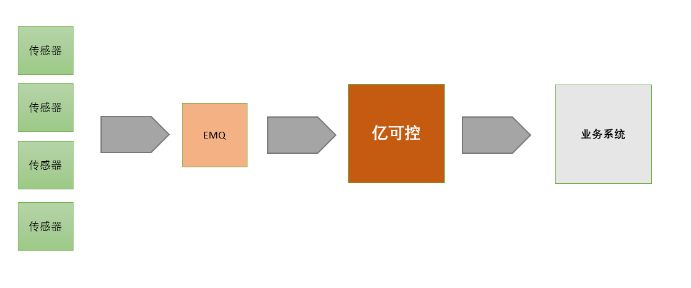

# 第1章 亿可控系统分析与设计

## 学习目标

- 了解物联网应用领域及发展现状
- 能够说出亿可控的核心功能
- 能够画出亿可控的系统架构图
- 能够完成亿可控环境的准备并了解亿可控的功能结构
- 完成设备管理相关功能的开发

## 1.物联网行业分析

### 1.1 什么是物联网

**物联网**（英文：*Internet of Things*，缩写：*IoT*）起源于传媒领域，是信息科技产业的第三次革命。物联网是指通过信息传感设备，按约定的协议，将任何物体与网络相连接，物体通过信息传播媒介进行信息交换和通信，以实现智能化识别、定位、跟踪、监管等功能。 

在物联网应用中有三项关键技术，分别是感知层、网络传输层和应用层。 

**中国式物联网定义：**

最简洁明了的定义：物联网(Internet of Things)是一个基于互联网、传统电信网等信息承载体，让所有能够被独立寻址的普通物理对象实现互联互通的网络。它具有普通对象设备化、自治终端互联化和普适服务智能化3个重要特征。


上图中出现了四个概念，我们这里分别解释一下：

**两化融合**是信息化和工业化的高层次的深度结合， 是指以信息化带动工业化、以工业化促进信息化，走新型工业化道路；两化融合的核心就是信息化支撑，追求可持续发展模式。

**M2M**全称Machine to Machine，是指数据从一台终端传送到另一台终端，也就是机器与机器的对话。

射频识别（RFID）是 Radio Frequency Identification 的缩写。其原理为阅读器与标签之间进行非接触式的数据通信，达到识别目标的目的。RFID 的应用非常广泛，典型应用有动物晶片、汽车晶片防盗器、门禁管制、停车场管制、生产线自动化、物料管理。

**传感网**是传感器网络的简称，传感器网络是集[计算机](https://wiki.mbalib.com/wiki/%E8%AE%A1%E7%AE%97%E6%9C%BA)、[通信](https://wiki.mbalib.com/wiki/%E9%80%9A%E4%BF%A1)、网络、智能计算、传感器、[嵌入式系统](https://wiki.mbalib.com/wiki/%E5%B5%8C%E5%85%A5%E5%BC%8F%E7%B3%BB%E7%BB%9F)、微电子等多个领域交叉综合的新兴学科，它将大量的多种类传感器节点(集传感、采集、处理、收发于一体)组成自治的网络，实现对物理世界的动态智能协同感知。

从上图中可以看出，物联网涵盖了上边所提到的四大领域。

**“一句式”理解物联网**

把所有物品通过信息传感设备与互联网连接起来，进行信息交换，即物物相息，以实现智能化识别和管理。

**历史溯源**

物联网这个概念，中国在1999年提出来的时候叫传感网。中科院早在1999年就启动了传感网的研究和开发。与其它国家相比，我国的技术研发水平处于世界前列，具有同发优势和重大影响力。
2005年11月27日，在突尼斯举行的信息社会峰会上，国际电信联盟（ITU）发布了《ITU互联网报告2005：物联网》，正式提出了物联网的概念。
2009年8月24日，中国移动总裁王建宙在台湾公开演讲中，也提到了物联网这个概念。
工信部总工程师朱宏任在中国工业运行2009年夏季报告会上表示，物联网是个新概念，到2009年为止还没有一个约定俗成的，大家公认的概念。他说，总的来说，“物联网”是指各类传感器和现有的“互联网”相互衔接的一种新技术。
物联网是在计算机互联网的基础上，利用RFID、无线数据通信等技术，构造一个覆盖世界上万事万物的“Internet of Things”。在这个网络中，物品(商品)能够彼此进行“交流”，而无需人的干预。其实质是利用射频自动识别(RFID)技术，通过计算机互联网实现物品(商品)的自动识别和信息的互联与共享。
物联网概念的问世，打破了之前的传统思维。过去的思路一直是将物理基础设施和IT基础设施分开，一方面是机场、公路、建筑物，另一方面是数据中心，个人电脑、宽带等。而在物联网时代,钢筋混凝土、电缆将与芯片、宽带整合为统一的基础设施，在此意义上，基础设施更像是一块新的地球。故也有业内人士认为物联网与智能电网均是智慧地球的有机构成部分。

### 1.2 物联网应用领域

1、智能家居
智能家居是利用先进的计算机技术，运用智能硬件（氦氪wifi、Zigbee、蓝牙、NB-iot等），物联网技术，通讯技术，将与家具生活的各种子系统有机的结合起来，通过统筹管理，让家居生活更舒适，方便，有效，与安全。智能家居主要包括智能音箱、智能灯、智能插座、智能锁、智能恒温器、扫地机器人等。

2、智慧交通
智慧交通，是将物联网、互联网、云计算为代表的智能传感技术、信息网络技术、通信传输技术和数据处理技术等有效地集成，并应用到整个交通系统中，在更大的时空范围内发挥作用的综合交通体系 [2]  。智慧交通是以智慧路网、智慧出行、智慧装备、智慧物流、智慧管理为重要内容，以信息技术高度集成、信息资源综合运用为主要特征的大交通发展新模式。依托迪蒙科技在云计算、物联网、大数据、金融科技等领域的丰富开发经验和雄厚的技术积累，历时3年倾力打造的中国目前首家 一款集网约专车、智慧停车、汽车租赁、汽车金融，以及其他智慧出行领域创新商业模式于一体的高端智慧交通整体解决方案 [3]  。

4、智能电网
智能电网是在传统电网的基础上构建起来的集传感、通信、计算、决策与控制为一体的综合数物复合系统，通过获取电网各层节点资源和设备的运行状态，进行分层次的控制管理和电力调配，实现能量流、信息流和业务流的高度一体化，提高电力系统运行稳定性，以达到最大限度地提高设备效利用率，提高安全可靠性，节能减排，提高用户供电质量，提高可再生能源的利用效率。

4、智慧城市
智慧城市就是运用信息和通信技术手段感测、分析、整合城市运行核心系统的各项关键信息，从而对包括民生、环保、公共安全、城市服务、工商业活动在内的各种需求做出智能响应。其实质是利用先进的信息技术，实现城市智慧式管理和运行，进而为城市中的人创造更美好的生活，促进城市的和谐、可持续成长。
随着人类社会的不断发展，未来城市将承载越来越多的人口。目前，我国正处于城镇化加速发展的时期，部分地区“城市病”问题日益严峻。为解决城市发展难题，实现城市可持续发展，建设智慧城市已成为当今世界城市发展不可逆转的历史潮流。
智慧城市的建设在国内外许多地区已经展开，并取得了一系列成果，国内的如智慧上海、智慧双流；国外如新加坡的“智慧国计划”、韩国的“U-City计划”等 。

5、其它领域：智能汽车、智能建筑、智能水务、智能商业、智能工业、平安城市、智能农业、智能安防、智能医疗等。

### 1.3 物联网发展现状

消费级IOT蓬勃发展，仍处初级阶段 

物联网通过相关设备将物与物、人与人进行联网。

（1）规模：全球物联网产业规模自 2008 年500亿美元增长至 2018 年仅 1510  亿美元，年均复合增速达 11.7%。我国物联网产业规模2017年达 11500亿元，自 2011 年起进一步加速，2009-2017  年均复合增速达 26.9%，我国物联网发展速度较全球平均水平更快。

（2）渗透：全球物联网行业渗透率 2013、2017 分别达  12%、29%，提升一倍多，预计2020年有超过 65%企业和组织将应用物联网产品和方案。近年来，我国物联网市场规模不断扩大，2012年的  3650 亿元增长到 2017 年的 11605 亿元，年复合增长率高达 25%。 


 2012-2017年我国物联网市场规模（亿元） 


 全球物联网渗透率变化 


 **消费级物联网：仍处于初级阶段** 

 消费级IOT预计快速增长。

（1）全球：2017全球消费级IOT硬件销售额达4859亿美元，同比增长29.5%，2015-2017 复合增速达  26.0%。2022 年销售额望达 15502 亿美元，2017-2022 年均复合增速达 26.1%。全球消费级 IOT  市场规模呈现进一步加速的趋势。

（2）中国大陆： 2017 中国大陆消费级 IOT 硬件销售额达 1188 亿美元，同比增长  30.0%，2015-2017 复合增速达 28.9%。2022年销售额望达 3118 亿美元， 2017-2022 年均复合增速达  21.3%。2017年前因小米等公司的快速发展，中国消费级 IOT 发展整体快于全球平均水平，2017 年后在中国消费级 IOT  仍维持高速发展的状况下，全球消费级 IOT 将发展更快。（3）连接设备：全球消费级 IOT 终端数量 2017年达 49 亿个，  2015-2017 年均复合增速达 27.7%，预计 2022 年达 153亿个， 2017-2022 年均复合增速达 25.4%。     2017 中国消费级 IOT 终端数量占世界达 26.5%，预计 2022 年占比提升至 29.4%， 2017-2022 预计复合增速达  28.2%。 

全球消费级IOT市场规模：

中国消费级IOT市场规模：

全球及中国IOT终端数量：


## 2.亿可控需求分析

### 2.1 需求概述

​      亿可控作为一个中台，对设备运行状况进行实时在线监测、预警，不做业务相关的功能。



​	核心功能列表：

​	（1）报文数据采集与指标解析 ：整个系统的数据来源是通过接收设备发送过来的报文消息，在系统中定义主题和消息内容字段的指标数据为过滤条件，从而对消息进行收集和分析。

​	（2）报警监控  ： 通过和系统中定义的各种告警级别数据进行对比，一旦发现触发到告警级别的消息，就会通过和告警关联配置的webhook来将告警信息透传到其它系统

​        （3）GPS定位监控 ：采集每台设备的GPS定位，并提供设备位置查询功能。

​        （4）数据看板 :   提供丰富的自定义数据看板。

### 2.2 业务架构图


从上图我们可以看到，真个系统从业务上分为6大功能模块：图形监控模块、数据详情展示模块、看板管理模块、设备管理模块、报警管理模块、系统管理模块。

### 2.3 核心业务描述

产品原型地址：

[https://app.mockplus.cn/run/prototype/yYVLQlJ-YN6/JhE4uVilt/4nw_LQ8n7](https://app.mockplus.cn/run/prototype/yYVLQlJ-YN6/JhE4uVilt/4nw_LQ8n7)

详见资源提供的《亿可控PRD文档》

## 3.亿可控系统架构

### 3.1 系统架构图

整个系统的技术架构图如下：


预制数据将放入MySQL里进行存储，设备上报的指标数据包括告警数据将存入influxDB中，设备的地理位置信息数据存入到ES中以便后期搜索。为了提高系统的运行稳定性，有些频繁访问的数据储存在redis中，因为考虑到设备上报的数据是非常频繁的，如果单单只依靠MySQL数据库的话，会很容易将MySQL服务器的CPU的占用率搞到100%，从而会引发整个系统的崩溃无法使用。

一些基本的配置放入到了consul的配置中心，考虑到系统的横向扩展能力，将整个系统基于Consul做注册中心来搭组建一个微服务。

### 3.2 数据库设计

mysql数据库有5个表：

**管理员表tb_admin**

| 列名         | 数据类型        | 说明                         |
| ---------- | ----------- | -------------------------- |
| id         | int         | 表主键id，自增                   |
| login_name | varchar(50) | 登录账号                       |
| password   | varchar(60) | 密码                         |
| type       | tinyint     | 类型 1:超级管理员 2:普通用户 目前作为保留字段 |
| board      | varchar(50) | 看板列表                       |

**指标配置表tb_quota**

| 列名              | 数据类型          | 说明                            |
| --------------- | ------------- | ----------------------------- |
| id              | int           | 表主键id                         |
| name            | varchar(50)   | 指标名称                          |
| unit            | varchar(20)   | 指标单位                          |
| subject         | varchar(50)   | 报文主题                          |
| value_key       | varchar(50)   | 指标值字段                         |
| sn_key          | varchar(50)   | 设备识别码字段                       |
| webhook         | varchar(1000) | web钩子                         |
| value_type      | varchar(10)   | 指标字段类型，Double、Inteter、Boolean |
| reference_value | varchar(100)  | 参考值                           |

**报警配置表tb_alarm**

| 列名        | 数据类型          | 说明             |
| --------- | ------------- | -------------- |
| id        | int           | 表主键id，自增       |
| name      | varchar(50)   | 报警指标名称         |
| quota_id  | int           | 关联指标名称         |
| operator  | varchar(10)   | 运算符            |
| threshold | int           | 报警阈值           |
| level     | int           | 报警级别 1：一般 2：严重 |
| cycle     | int           | 沉默周期(以分钟为单位)   |
| webhook   | varchar(1000) | web钩子地址        |

**面板配置表tb_board**

| 列名       | 数据类型         | 说明       |
| -------- | ------------ | -------- |
| id       | int          | 表主键id，自增 |
| admin_id | int          | 管理员id    |
| name     | varchar(50)  | 看板名称     |
| quota    | varchar(100) | 指标       |
| device   | varchar(100) | 设备       |
| system   | tinyint      | 是否是系统看板  |
| disable  | tinyint      | 是否不显示    |

**GPS配置表tb_gps**

| 列名         | 数据类型        | 说明          |
| ---------- | ----------- | ----------- |
| id         | bigint      | 表主键id       |
| subject    | varchar(50) | 报文主题        |
| sn_key     | varchar(50) | 设备识别码字段     |
| type       | tinyint     | 类型（单字段、双字段） |
| value_key  | varchar(50) | 经纬度字段       |
| separation | varchar(10) | 经纬度分隔符      |
| longitude  | varchar(20) | 经度字段        |
| latitude   | varchar(20) | 维度字段        |

## 4.基础代码解析

### 4.1 环境准备

#### 4.1.1 加载虚拟机镜像

使用课程配套的虚拟机镜像。

网络连接建议使用NAT模式。

本课程讲义中提供的代码，192.168.200.128为宿主机IP，如果你加载镜像后不是此IP请自行调整。

已安装好docker环境，并已拉取了所需镜像，开箱即用。

#### 4.1.2 MySQL建库建表

连接虚拟机的mysql ，用户名root ，密码root123

创建数据库ykk，创建表

```sql
create table if not exists tb_admin
(
	id int auto_increment
		primary key,
	login_name varchar(50) null comment '登录名',
	password varchar(60) null comment '密码',
	type tinyint null comment '类型 1超级管理员 0普通用户',
	board varchar(50) null comment '看板'
);

create table if not exists tb_alarm
(
	id int auto_increment comment 'id'
		primary key,
	name varchar(50) null comment '报警名称',
	quota_id int null comment '指标id',
	operator varchar(10) null comment '运算符',
	threshold int null comment '报警阈值',
	level int null comment '报警级别  1一般 2严重',
	cycle int null comment '沉默周期（分钟）',
	webhook varchar(1000) null comment 'web钩子',
	constraint tb_alarm_name_uindex
		unique (name)
);

create table if not exists tb_board
(
	id int auto_increment comment 'id'
		primary key,
	admin_id int default 1 null comment '管理员id',
	name varchar(50) null comment '看板名称',
	quota varchar(100) default '0' null comment '指标(趋势时设置)',
	device varchar(100) null comment '设备(累计)',
	`system` tinyint default 0 null comment '是否是系统看板',
	disable tinyint default 0 null comment '是否不显示',
	constraint tb_board_name_uindex
		unique (name)
);


create table if not exists tb_gps
(
	id int not null comment 'id'
		primary key,
	subject varchar(50) null comment '主题',
	sn_key varchar(50) null comment '设备识别码字段',
	single_field tinyint null comment '类型（单字段、双字段）',
	value_key varchar(50) null comment '经纬度字段',
	separation varchar(10) null comment '经纬度分隔符',
	longitude varchar(20) null comment '经度字段',
	latitude varchar(20) null comment '维度字段',
	constraint tb_gps_subject_uindex
		unique (subject)
);

create table if not exists tb_quota
(
	id int auto_increment comment 'id'
		primary key,
	name varchar(50) null comment '指标名称',
	unit varchar(20) null comment '指标单位',
	subject varchar(50) null comment '报文主题',
	value_key varchar(50) null comment '指标值字段',
	sn_key varchar(50) null comment '设备识别码字段',
	webhook varchar(1000) null comment 'web钩子',
	value_type varchar(10) null comment '指标字段类型，Double、Inteter、Boolean',
	reference_value varchar(100) null comment '参考值',
	constraint tb_quota_name_uindex
		unique (name)
);
```

#### 4.1.3 Consul添加配置

（1）进入Consul  

打开浏览器，输入地址  http://192.168.200.128:8500/

（2）创建配置  key为   config/backend-service/data     value如下

```yaml
spring: 
  datasource:
    url: jdbc:mysql://192.168.200.128:3306/ykk?useUnicode=true&autoReconnect=true&autoReconnectForPools=true&characterEncoding=utf8&serverTimezone=Asia/Shanghai
    username: root
    password: root123
    driver-class-name: com.mysql.jdbc.Driver
  redis:
    host: 192.168.200.128
    port: 6379
    database: 0
    lettuce:
      pool:
        max-active: 10
        max-wait: -1
        max-idle: 5
        min-idle: 1
      shutdown-timeout: 100
    timeout: 1000
    password:  
```

### 4.2 工程结构解析

项目主体框架截图如下：


目前项目主要分为两个部分：ykk-common和ykk-backend。

ykk-common模块存放系统的一些基础通用性定义，包括通用异常定义、数据库联接定义、还有一些常量定义。

ykk-backend模块是我们后台逻辑的实现代码，里面按照具体的功能实现拆分到了具体的包里。

### 4.3 核心代码解析

#### 4.3.1 用户登录与JWT校验

（1）用户登录业务逻辑

```java
package com.yikekong.service.impl;

import com.baomidou.mybatisplus.core.conditions.query.QueryWrapper;
import com.baomidou.mybatisplus.extension.service.impl.ServiceImpl;
import com.google.common.base.Strings;
import com.yikekong.entity.AdminEntity;
import com.yikekong.mapper.AdminMapper;
import com.yikekong.service.AdminService;
import org.springframework.security.crypto.bcrypt.BCryptPasswordEncoder;
import org.springframework.stereotype.Service;

@Service
public class AdminServiceImpl extends ServiceImpl<AdminMapper,AdminEntity> implements AdminService{
    @Override
    public Integer login(String loginName, String password) {
        if(Strings.isNullOrEmpty(loginName) || Strings.isNullOrEmpty(password)){
            return -1;
        }
        QueryWrapper<AdminEntity> queryWrapper = new QueryWrapper<>();
        queryWrapper
                .lambda()
                .eq(AdminEntity::getLoginName,loginName);
        AdminEntity adminEntity = this.getOne(queryWrapper);
        if(adminEntity == null)
            return -1;

        BCryptPasswordEncoder passwordEncoder = new BCryptPasswordEncoder();
        if(passwordEncoder.matches(password,adminEntity.getPassword())){
            return adminEntity.getId();
        }

        return -1;
    }
}
```

（2）用户登录控制器类

```java
@RestController
public class AdminController{
    @Autowired
    private AdminService adminService;

    @PostMapping("/login")
    public LoginResultVO login(@RequestBody AdminVO admin){
        LoginResultVO result = new LoginResultVO();
        Integer adminId = adminService.login(admin.getLoginName(),admin.getPassword());
        if(adminId < 0){
            result.setLoginSuccess(false);
            return result;
        }
        result.setAdminId(adminId);
        String token = JwtUtil.createJWT(adminId);
        result.setToken(token);
        result.setLoginSuccess(true);

        return result;
    }
}
```

（3）登录校验

httpfilter包里AuthFilter是我们jwt的过滤器，主要来校验jwt token，该类的实现如下：

```java
package com.yikekong.httpfilter;


import org.elasticsearch.common.Strings;
import org.springframework.http.HttpStatus;
import org.springframework.stereotype.Component;

import javax.servlet.*;
import javax.servlet.annotation.WebFilter;
import javax.servlet.http.HttpServletRequest;
import javax.servlet.http.HttpServletResponse;
import java.io.IOException;

@Component
@WebFilter(urlPatterns = "/*",filterName = "authFilter")
public class AuthFilter implements Filter{
    @Override
    public void doFilter(ServletRequest servletRequest, ServletResponse servletResponse, FilterChain filterChain) throws IOException, ServletException {
        HttpServletRequest req = (HttpServletRequest)servletRequest;
        HttpServletResponse resp = (HttpServletResponse)servletResponse;
        String path = ((HttpServletRequest) servletRequest).getServletPath();
        //如果访问的是login接口，不进行jwt token校验
        if(path.equals("/login")){
            filterChain.doFilter(servletRequest, servletResponse);
            return;
        }
        String authToken = ((HttpServletRequest) servletRequest).getHeader("Authorization");
        //如何header中不存在Authorization的值，直接返回校验失败
        if(Strings.isNullOrEmpty(authToken)){
            ((HttpServletResponse) servletResponse).setStatus(HttpStatus.UNAUTHORIZED.value());
            return;
        }

        try {
            JwtUtil.parseJWT(authToken);
        } catch (Exception e) {
            //jwt校验失败，返回
            ((HttpServletResponse) servletResponse).setStatus(HttpStatus.UNAUTHORIZED.value());
            return;
        }

        filterChain.doFilter(servletRequest, servletResponse);
    }
}
```

#### 4.3.2 指标管理-创建指标

QuotaController的create方法用于创建指标

```java
/**
 * 创建指标
 * @param vo
 * @return
 */
@PostMapping
public boolean create(@RequestBody QuotaVO vo){
    QuotaEntity quotaEntity = new QuotaEntity();
    BeanUtils.copyProperties(vo,quotaEntity);
    return quotaService.save(quotaEntity);
}
```

此方法接收的vo类，是前端的封装视图对象。有很多时候，前端传递过来的数据与我们后端数据库对应的不一定完全一致，所以我们通常的做法是创建一个单独的vo类，用于与前端进行数据的传输。这样如果前端传递的数据对象发送结构变化，并不会影响到后端数据库结构。

`BeanUtils.copyProperties(vo,quotaEntity);`  用于对象数据的拷贝，如果两个对象有相同的属性，会自动复制属性，这样可以避免在代码中出现大量的setter方法。

## 5. 设备管理

### 5.1 设备添加

#### 5.1.1 需求分析

在亿可控系统中，我们不能也不需要从系统界面中添加设备。设备的添加，是在亿可控接收到设备发过来的报文，解析后保存的。由于物联网类的应用所使用的设备数量可能非常庞大，而对这部分数据的读写频率又很频繁，所以我们使用elasticsearch作为设备的数据库。

#### 5.1.2 索引库结构设计

设备库  device

| 列名        | 数据类型    | 说明   |
| --------- | ------- | ---- |
| deviceId  | keyword | 设备编号 |
| alarm     | boolean | 是否告警 |
| alarmName | keyword | 告警名称 |
| level     | integer | 告警级别 |
| online    | boolean | 是否在线 |
| status    | boolean | 开关   |
| tag       | keyword | 标签   |


#### 5.1.3 代码实现

（1）创建索引库（打开kibana创建  [http://192.168.200.128:5601/](http://192.168.200.128:5601/)）

```json
PUT /devices
{
    "mappings": {
        "properties": {
            "deviceId": {
                "type": "keyword"
            },
            "alarm": {
                "type": "boolean"
            },
            "alarmName": {
                "type": "keyword"
            },
            "level": {
                "type": "integer"
            },
            "online": {
                "type": "boolean"
            },
            "status": {
                "type": "boolean"
            },
            "tag": {
                "type": "keyword"
            }
        }
    }
}
```

（2）pom.xml添加配置

```xml
<!--es相关依赖-->
<dependency>
    <groupId>org.elasticsearch.client</groupId>
    <artifactId>elasticsearch-rest-high-level-client</artifactId>
    <version>7.7.1</version>
</dependency>
<dependency>
    <groupId>org.elasticsearch</groupId>
    <artifactId>elasticsearch</artifactId>
    <version>7.7.1</version>
</dependency>
<dependency>
    <groupId>org.elasticsearch.client</groupId>
    <artifactId>elasticsearch-rest-client</artifactId>
    <version>7.7.1</version>
</dependency>
<!--es相关依赖结束-->
```

（3）在配置文件中添加配置，以下配置添加到spring节点下

```yaml

  elasticsearch:
    rest:
      uris: http://192.168.200.128:9200
```

（4）创建包com.yikekong.dto ， 创建用于封装设备的DTO类

```java
package com.yikekong.dto;

import lombok.Data;

import java.io.Serializable;

/**
 * 设备DTO
 */
@Data
public class DeviceDTO implements Serializable {

    private String deviceId;//设备编号

    private Boolean alarm;// 是否告警

    private String alarmName;//告警名称

    private Integer level;//告警级别

    private Boolean online;//是否在线

    private String tag;// 标签

    private Boolean status;//开关状态
        
}
```

（5）创建com.yikekong.es包，包下创建ESRepository类，并编写添加设备的方法

```java
package com.yikekong.es;

import com.fasterxml.jackson.core.JsonProcessingException;
import com.yikekong.dto.DeviceDTO;
import com.yikekong.util.JsonUtil;
import lombok.extern.slf4j.Slf4j;
import org.elasticsearch.action.index.IndexRequest;
import org.elasticsearch.client.RequestOptions;
import org.elasticsearch.client.RestHighLevelClient;
import org.springframework.beans.factory.annotation.Autowired;
import org.springframework.stereotype.Component;
import java.io.IOException;
import java.util.Map;

@Component
@Slf4j
public class ESRepository{

    @Autowired
    private RestHighLevelClient restHighLevelClient;

    /**
     * 添加设备
     * @param deviceDTO
     */
    public  void addDevices(DeviceDTO deviceDTO){
        if(deviceDTO==null ) return;
        if(deviceDTO.getDeviceId()==null) return;
        IndexRequest request=new IndexRequest("devices");
        try {
            String json = JsonUtil.serialize(deviceDTO);
            Map map = JsonUtil.getByJson(json, Map.class);
            request.source(map);
            request.id(deviceDTO.getDeviceId());
            restHighLevelClient.index(request, RequestOptions.DEFAULT);
        } catch (JsonProcessingException e) {
            e.printStackTrace();
        } catch (IOException e) {
            e.printStackTrace();
            log.error("设备添加发生异常");
        }
    }
}
```

#### 5.1.4 单元测试

编写单元测试

```java
import com.yikekong.YkkApplication;
import com.yikekong.dto.DeviceDTO;
import com.yikekong.es.ESRepository;
import org.junit.Test;
import org.junit.runner.RunWith;
import org.springframework.beans.factory.annotation.Autowired;
import org.springframework.boot.test.context.SpringBootTest;
import org.springframework.test.context.junit4.SpringRunner;

@SpringBootTest(classes = YkkApplication.class)
@RunWith(SpringRunner.class)
public class EsTest {

    @Autowired
    private ESRepository esRepository;

    @Test
    public void testAdd(){
        DeviceDTO deviceDTO=new DeviceDTO();
        deviceDTO.setDeviceId("123456");
        deviceDTO.setStatus(true);
        deviceDTO.setAlarm(false);
        deviceDTO.setLevel(0);
        deviceDTO.setAlarmName("");
        deviceDTO.setOnline(true);
        deviceDTO.setTag("");
        esRepository.addDevices(deviceDTO);
    }
}
```

查询数据，验证运行结果

```json
GET devices/_search
{
  "query": {
    "match_all": {}
  }
}
```

### 5.2 根据设备ID查询设备

#### 5.2.1 需求分析

根据id从elasticsearch中查询设备信息。在之后的报文解析的逻辑中需要调用此方法来实现设备的查询。

#### 5.2.2 代码实现

ESRepository类添加方法

```java
/**
 * 根据设备id 查询设备
 * @param deviceId  设备id
 * @return
 */
public DeviceDTO searchDeviceById(String deviceId){
    SearchRequest searchRequest=new SearchRequest("devices");
    SearchSourceBuilder searchSourceBuilder=new SearchSourceBuilder();
    searchSourceBuilder.query(QueryBuilders.termQuery("_id",deviceId));
    searchRequest.source(searchSourceBuilder);
    try {
        SearchResponse searchResponse = restHighLevelClient.search(searchRequest, RequestOptions.DEFAULT);

        SearchHits hits = searchResponse.getHits();
        long hitsCount = hits.getTotalHits().value;
        if(hitsCount<=0) return null;
        DeviceDTO deviceDTO=null;
        for(SearchHit hit:hits){
            String hitResult = hit.getSourceAsString();
            deviceDTO=JsonUtil.getByJson(hitResult,DeviceDTO.class  );
            deviceDTO.setDeviceId(deviceId);
            break;
        }
        return deviceDTO;

    } catch (IOException e) {
        e.printStackTrace();
        log.error("查询设备异常");
        return null;
    }
}
```

#### 5.2.3 单元测试

编写单元测试方法，验证代码是否正确

```java
@Test
public void testSearchById(){

    DeviceDTO deviceDTO = esRepository.searchDeviceById("123456");
    try {
        String json = JsonUtil.serialize(deviceDTO);
        System.out.println(json);

    } catch (JsonProcessingException e) {
        e.printStackTrace();
    }

}
```

### 5.3 设置设备状态 

#### 5.3.1 需求分析 

当我们不需要接收某设备的报文，可以将其关闭。已经关闭的设备对接收的报文指标不做任何处理。


#### 5.3.2 API 接口


#### 5.3.3 代码实现

（1）ESRepository类添加方法实现对设备的开与关。

```java
/**
 * 更新设备状态
 * @param deviceId
 * @param status
 * @return
 */
public boolean updateStatus(String deviceId,Boolean status){
    UpdateRequest updateRequest=new UpdateRequest("devices",deviceId)
            .doc( "status",status );
    try {
        restHighLevelClient.update( updateRequest,RequestOptions.DEFAULT );
        return true;
    } catch (IOException e) {
        e.printStackTrace();
        log.error("更新设备状态出错");
        return false;
    }
}
```

（2）DeviceService新增方法定义

```java
/**
 * 更改设备状态
 * @param deviceId
 * @param status
 * @return
 */
boolean setStatus(String deviceId, Boolean status);
```

DeviceServiceImpl实现方法

```java
@Autowired
private ESRepository esRepository;

@Override
public boolean setStatus(String deviceId, Boolean status) {
    DeviceDTO deviceDTO = findDevice(deviceId);
    if( deviceDTO==null ) return false;
    return esRepository.updateStatus(deviceId,status);
}

/**
 * 根据设备id查询设备
 * @param deviceId
 * @return
 */
private DeviceDTO findDevice(String deviceId){
    DeviceDTO deviceDTO = esRepository.searchDeviceById(deviceId);
    return deviceDTO;
}
```

（3）DeviceController新增方法

```java
/**
 * 设置状态的接口
 * @param deviceVO
 * @return
 */
@PutMapping("/status")
public boolean setStatus(@RequestBody DeviceVO deviceVO){
    return deviceService.setStatus(deviceVO.getSn(),deviceVO.getStatus());
}
```

#### 5.3.4 接口测试

（1）运行YkkApplication启动工程

（2）测试接口。为了方便测试，我们采用vscode的Rest Client插件来进行测试。脚本是课程提供的“资料\测试\yikekong.http”  ，用vscode打开，找到以下脚本

```json
####修改设备状态########
PUT   http://{{hostname}}:{{port}}/device/status HTTP/1.1
Authorization: {{Authorization}}
Content-Type: {{contentType}}

{
    "sn":"123456",
    "status":true
}
```

我们可以修改status值后 点击  Send Request 链接进行测试

### 5.4 设置设备标签

#### 5.4.1 需求分析 

我们为了方便之后对设备进行查询，我们可以对每个设备设置一个或多个标签。在前端界面上没有更新设备标签的功能，此功能只对外部系统提供调用的接口。

#### 5.4.2 代码实现

（1）ESRepository类添加方法

```java
/**
 * 更新设备标签
 * @param deviceId
 * @param tags
 * @return
 */
public boolean updateDeviceTag(String deviceId,String tags){
    UpdateRequest updateRequest=new UpdateRequest("devices",deviceId)
            .doc( "tag",tags );
    try {
        restHighLevelClient.update( updateRequest,RequestOptions.DEFAULT );
        return true;
    } catch (IOException e) {
        e.printStackTrace();
        log.error("更新设备标签出错");
        return false;
    }
}
```

（2）DeviceService新增方法

```java
/**
 * 更新设备标签
 * @param deviceId
 * @param tags
 * @return
 */
boolean updateTags(String deviceId,String tags);
```

DeviceServiceImpl实现方法

```java
@Override
public boolean updateTags(String deviceId, String tags) {
    DeviceDTO deviceStatus = findDevice(deviceId);
    if(deviceStatus == null) return false;
    esRepository.updateDeviceTag(deviceId,tags);
    return true;
}
```

（3）DeviceController新增方法

```java
/**
 * 设置标签的接口
 * @param deviceVO
 * @return
 */
@PutMapping("/tags")
public boolean setTags(@RequestBody DeviceVO deviceVO){
    return deviceService.updateTags(deviceVO.getSn(),deviceVO.getTags());
}
```

（4）AuthFilter类的doFilter新增代码，对tags放行

```java
//tag接口不校验token
if(path.contains("/device/tags")){
	filterChain.doFilter(servletRequest, servletResponse);
	return;
}
```

#### 5.4.3 接口测试

（1）启动工程

（2）找到以下脚本，进行测试

```json
####设置设备标签############
PUT   http://{{hostname}}:{{port}}/device/tags HTTP/1.1
Content-Type: {{contentType}}

{
    "sn":"123456",
    "tags":"学校"
}
```

### 5.5 更新设备告警信息

#### 5.5.1 需求分析 

当设备发送过来的报文中的指标信息达到告警级别，我们应该更新elasticsearch中的更新设备告警信息（是否告警、告警级别、告警名称）

#### 5.5.2 代码实现

ESRepository类添加方法

```java
/**
 * 更新设备告警信息
 * @param deviceDTO
 * @return
 */
public boolean updateDevicesAlarm(DeviceDTO deviceDTO){
    UpdateRequest updateRequest=new UpdateRequest("devices",deviceDTO.getDeviceId())
            .doc(   "alarm",deviceDTO.getAlarm(),//是否告警
                    "level",deviceDTO.getLevel(),//告警级别
                    "alarmName",deviceDTO.getAlarmName() );//告警名称
    try {
        restHighLevelClient.update( updateRequest,RequestOptions.DEFAULT );
        return true;
    } catch (IOException e) {
        e.printStackTrace();
        log.error("更新设备告警信息出错");
        return false;
    }
}
```

#### 5.5.3 单元测试

编写单元测试，在TestES中新增测试方法

```java
@Test
public void testAlarm(){
    DeviceDTO deviceDTO=new DeviceDTO();
    deviceDTO.setDeviceId("123456");
    deviceDTO.setAlarm(true);
    deviceDTO.setLevel(1);
    deviceDTO.setAlarmName("温度过高");

    esRepository.updateDevicesAlarm(deviceDTO);

}
```

### 5.6 更新在线状态 

#### 5.6.1 需求分析  

在线状态是指这个设备是否在线，如果设备存在网络故障就会导致设备离线。亿可控系统可以监测设备的在线和离线状态

#### 5.6.2 代码实现

我们这里需要在ESRepository类添加方法用于更新在线状态。

```java
/**
 * 更新在线状态
 * @param deviceId
 * @param online
 * @return
 */
public boolean updateOnline(String deviceId,Boolean online){
    UpdateRequest updateRequest=new UpdateRequest("devices",deviceId)
            .doc( "online",online );
    try {
        restHighLevelClient.update( updateRequest,RequestOptions.DEFAULT );
        return true;
    } catch (IOException e) {
        e.printStackTrace();
        log.error("更新在线状态出错");
        return false;
    }
}
```

#### 5.6.3 单元测试

编写单元测试，在TestES中新增测试方法

```java
@Test
public void testOnline(){
    esRepository.updateOnline("123456",false);
}
```

### 5.7 分页查询设备

#### 5.7.1 需求分析

有两个页面需要实现分页查询设备

（1）设备管理，如下图效果，需要设备编号、标签作为查询条件分页查询


（2）设备详情，如下图效果，需要设备状态、标签、设备编号作为查询条件分页查询


设备详情页比设备管理多了一个“设备状态”的查询条件，设备状态有四个值：在线（0）、离线（1）、一般告警（2）、严重告警（3） 。

为了不让代码冗余，我们这两个功能可以用同一个方法实现。

#### 5.7.2 代码实现

ESRepository类添加方法

```java
/**
 * 分页查询设备
 * @param page 页码
 * @param pageSize 页大小
 * @param deviceId 设备编号
 * @param tags 标签
 * @param state 状态
 * @return
 */
public Pager<DeviceDTO> searchDevice(Long page,Long pageSize,String deviceId,String tags,Integer state){

    SearchRequest searchRequest=new SearchRequest("devices");
    SearchSourceBuilder sourceBuilder=new SearchSourceBuilder();
    //条件查询
    BoolQueryBuilder boolQueryBuilder=QueryBuilders.boolQuery();
    //设备编号
    if(!Strings.isNullOrEmpty(deviceId)) {
        boolQueryBuilder.must(QueryBuilders.wildcardQuery("deviceId", deviceId + "*"));
    }
    //标签
    if(!Strings.isNullOrEmpty(tags) ){
        boolQueryBuilder.must(QueryBuilders.wildcardQuery("tag","*"+tags+"*"));
    }
    //状态（在线状态和告警状态）  0：在线  1：离线  2：一般告警  3：严重告警
    if(state!=null){
        if(state.intValue()==0){
            boolQueryBuilder.must( QueryBuilders.termQuery("online",true));
        }
        if(state.intValue()==1){
            boolQueryBuilder.must( QueryBuilders.termQuery("online",false));
        }
        if(state.intValue()==2){
            boolQueryBuilder.must( QueryBuilders.termQuery("level",1));
        }
        if(state.intValue()==3){
            boolQueryBuilder.must( QueryBuilders.termQuery("level",2));
        }
    }
    sourceBuilder.query(boolQueryBuilder);
    //分页
    sourceBuilder.from( (page.intValue()-1)*pageSize.intValue()  );
    sourceBuilder.size( pageSize.intValue() );
    sourceBuilder.trackTotalHits(true);

    //排序
    sourceBuilder.sort("level", SortOrder.DESC);//告警级别高的排前面
    searchRequest.source(sourceBuilder);
    try {
        SearchResponse searchResponse = restHighLevelClient.search(searchRequest, RequestOptions.DEFAULT);

        SearchHits hits = searchResponse.getHits();
        SearchHit[] searchHits = hits.getHits();
        List<DeviceDTO> devices= Lists.newArrayList();
        for(SearchHit hit: searchHits){
            String hitResult = hit.getSourceAsString();
            DeviceDTO deviceDTO = JsonUtil.getByJson(hitResult, DeviceDTO.class);
            devices.add(deviceDTO);
        }
        Pager<DeviceDTO> pager=new Pager<>(   searchResponse.getHits().getTotalHits().value,pageSize );
        pager.setItems(devices);
        return  pager;
    } catch (IOException e) {
        e.printStackTrace();
        log.error("查询设备失败");
        return null;
    }
}
```

（2）DeviceService新增方法定义

```java
/**
 * 搜索设备
 * @param page
 * @param pageSize
 * @param sn
 * @param tag
 * @return
 */
Pager<DeviceDTO> queryPage(Long page, Long pageSize, String sn, String tag, Integer status);
```

  DeviceServiceImpl实现方法

```java
@Override
public Pager<DeviceDTO> queryPage(Long page, Long pageSize, String sn, String tag, Integer status) {
    return  esRepository.searchDevice(page,pageSize,sn,tag,status);
}
```

（3）DeviceController新增方法

```java
/**
 * 分页搜索设备
 * @param page
 * @param pageSize
 * @param sn
 * @param tag
 * @return
 */
@GetMapping
public Pager<DeviceDTO> findPage(@RequestParam(value = "page",required = false,defaultValue = "1") Long page,
                                 @RequestParam(value = "pageSize",required = false,defaultValue = "10") Long pageSize,
                                 @RequestParam(value = "sn",required = false) String sn,
                                 @RequestParam(value = "tag",required = false) String tag){
    return deviceService.queryPage(page,pageSize,sn,tag,null);
}
```

# 第2章 指标数据采集与断连监控

## 学习目标

- 能够完成EMQ指标主题订阅
- 能够完成指标数据的解析
- 能够完成告警判断与存储
- 能够运用EMQ的webhook实现设备断连监控

## 1. EMQ指标主题订阅

### 1.1 Eclipse paho简介

Eclipse paho是eclipse基金会下面的一个开源项目，基于MQTT协议的客户端，用多种语言的实现。什么是MQTT？可以关注之前的EMQ课程，里面有详细介绍。 这几年的很火的物联网多是基于这个协议来通信的。

Eclipse paho支持的客户端语言很多，有java、Python、JavaScript、GoLang、C 、C++ 、C#等。

这里我们使用的是基于java语言版本的实现，这个版本的实现可以运行在JVM之上或者其他兼容于java的平台，比如安卓平台上。

Paho Java Client提供了两种API：

**MqttAsyncClient**:该API是完全基于异步来实现的，通过在启动时注册一个回调(callbacks)，来实现消息的异步收发处理。

**MqttClient**:是基于同步的方式实现的消息收发处理，在亿可控项目中我们使用同步的方式来接收处理消息。

### 1.2 发送与订阅消息

#### 1.2.1 发送消息

（1）添加和emq通信包paho的引用，paho不光能和emq通信，只要是基于mqtt协议实现的消息代理服务器，paho都能作为客户端和其进行通信。同时编写和mqtt通信的客户端代码。

```xml
<dependency>
    <groupId>org.eclipse.paho</groupId>
    <artifactId>org.eclipse.paho.client.mqttv3</artifactId>
    <version>1.2.2</version>
</dependency>
```

(2) 在consul中添加emq相关的配置：

```yaml
emq:
  mqttServerUrl: tcp://192.168.200.128:1883
```

（3）在com.yikekong.config包下定义emq配置类：

```java
package com.yikekong.config;

import org.springframework.boot.context.properties.ConfigurationProperties;
import org.springframework.context.annotation.Configuration;

@Configuration
@ConfigurationProperties("emq")
@Data
public class EmqConfig{
    private String mqttServerUrl;
}
```

（4）编写EMQ客户端类，新增连接方法

```java
package com.yikekong.emq;

import com.yikekong.config.EmqConfig;
import lombok.extern.slf4j.Slf4j;
import org.eclipse.paho.client.mqttv3.MqttClient;
import org.eclipse.paho.client.mqttv3.MqttConnectOptions;
import org.eclipse.paho.client.mqttv3.MqttException;
import org.eclipse.paho.client.mqttv3.MqttMessage;
import org.eclipse.paho.client.mqttv3.persist.MemoryPersistence;
import org.springframework.beans.factory.annotation.Autowired;
import org.springframework.stereotype.Component;

import java.util.UUID;

@Component
@Slf4j
public class EmqClient{
    @Autowired
    private EmqConfig emqConfig;//emq配置

    private MqttClient mqttClient;

    /**
     * 连接mqtt broker
     */
    public void connect(){
        try {
            mqttClient = new MqttClient(
                 emqConfig.getMqttServerUrl(),"monitor."+ UUID.randomUUID().toString());
          		mqttClient.connect();
        } catch (MqttException e) {
            log.error("mqtt creat error",e);
        }
    }

}
```

（5）编写发布消息的方法

```java
    /**
     * 发布消息
     * @param topic 消息主题
     * @param msg 发送的消息
     */
    public void publish(String topic,String msg){
        try {
            MqttMessage mqttMessage = new MqttMessage(msg.getBytes());
            mqttClient.getTopic(topic).publish(mqttMessage);//向某主题发送消息
        } catch (MqttException e) {
            log.error("mqtt publish msg error",e);
        }
    }
```

测试：

（1）编写单元测试

```java
@SpringBootTest
@RunWith(SpringRunner.class)
public class EmqTest {

    @Autowired
    private EmqClient emqClient;

    @Test
    public void testSend(){
        emqClient.connect();
        emqClient.publish("test_topic","test_content");
    }
}
```

（2）打开EMQ

http://192.168.200.128:18083   ，选择Tools下的Websocket进行测试


（3）连接并订阅主题


输入主题名称test_topic


（4）调用单元测试方法


测试后可以看到列表中有接收到的消息。


#### 1.2.2 订阅消息 

（1）EmqClient类新增方法，用于订阅主题

```java
/**
     * 订阅主题
     * @param topicName
     * @throws MqttException
     */
public void subscribe(String topicName) throws MqttException {
  	mqttClient.subscribe(topicName);
}
```

（2）接收消息回调类：  com.yikekong.emq包下创建消息接收处理类：

```java
package com.yikekong.emq;
import com.fasterxml.jackson.databind.ObjectMapper;
import com.yikekong.dto.*;
import com.yikekong.entity.GPSEntity;
import com.yikekong.es.ESRepository;
import com.yikekong.service.*;
import lombok.extern.slf4j.Slf4j;
import org.eclipse.paho.client.mqttv3.IMqttDeliveryToken;
import org.eclipse.paho.client.mqttv3.MqttCallback;
import org.eclipse.paho.client.mqttv3.MqttException;
import org.eclipse.paho.client.mqttv3.MqttMessage;
import org.springframework.beans.factory.annotation.Autowired;
import org.springframework.stereotype.Component;
import java.util.Map;

@Component
@Slf4j
public class EmqMsgProcess implements MqttCallback{

    @Override
    public void connectionLost(Throwable throwable) {
    }

    @Override
    public void messageArrived(String topic, MqttMessage mqttMessage) throws Exception {
        String payload = new String(mqttMessage.getPayload());
        System.out.println("接收到数据："+payload);
    }

    @Override
    public void deliveryComplete(IMqttDeliveryToken iMqttDeliveryToken) {

    }

}
```

（3）修改EmqClient的connect方法，添加代码

```java
mqttClient.setCallback(emqMsgProcess);
```

（4）编写监控类，启动后自动订阅主题

```java
package com.yikekong.core;

import com.yikekong.emq.EmqClient;
import com.yikekong.service.QuotaService;
import lombok.extern.slf4j.Slf4j;
import org.eclipse.paho.client.mqttv3.MqttException;
import org.springframework.beans.factory.annotation.Autowired;
import org.springframework.stereotype.Component;
import javax.annotation.PostConstruct;
/**
 * 自动监控
 */
@Component
@Slf4j
public class Monitor{
  
    @Autowired
    private EmqClient emqClient;
  
    @PostConstruct
    public void init(){
        emqClient.connect();
        emqClient.subscribe("mytopic");
    }
}
```

测试：

（1）启动工程

（2）打开emq的websocket 工具， 连接，向mytopic主题发送消息


点击发送后，控制台可以显示出接收的消息


### 1.3 订阅指标主题

#### 1.3.1 需求分析

亿可控实现功能：订阅指标配置中的主题。


#### 1.3.2 实现思路

（1）系统启动时，获取所有的主题名称，循环调用订阅主题的方法。

（2）创建新的指标时，根据设置的主题名称订阅。

#### 1.3.3 代码实现 

（1）修改Monitor的init方法，实现启动时订阅所有指标配置的主题

```java
@Component
@Slf4j
public class Monitor {

    @Autowired
    private EmqClient emqClient;

    @Autowired
    private QuotaService quotaService;

    @PostConstruct
    public void init(){
        System.out.println("初始化方法，订阅主题");
        emqClient.connect();
        quotaService.getAllSubject().forEach(s -> {
            try {
                emqClient.subscribe("$queue/"+s);
            } catch (MqttException e) {
                e.printStackTrace();
            }
        });
    }
}
```

需要注意的是在订阅主题的时候我们使用了共享队列来接收($queue/)，主要考虑到的是客户端物联网设备的个数比较庞大，在同一时刻或一段时间之内，上报的消息量过于庞大，接收消息的地方会很容易被击垮。使用共享队列，天然的平滑支持了分布式部署，面对巨大的消息量我们只需要部署多份亿可控节点来接收消息并处理就行了，无需做任何复杂的负载均衡处理，这样对研发和部署成本是最低的。

（2）修改QuotaController的create方法，新增主题订阅代码

```java
    @Autowired
    private EmqClient emqClient;

    /**
     * 创建指标
     * @param vo
     * @return
     */
    @PostMapping
    public boolean create(@RequestBody QuotaVO vo){
        try {
            QuotaEntity quotaEntity = new QuotaEntity();
            BeanUtils.copyProperties(vo,quotaEntity);
            emqClient.subscribe("$queue/"+quotaEntity.getSubject());//添加这句！

            return quotaService.save(quotaEntity);
        }catch (DuplicateKeyException e){
            throw new BussinessException("已存在该名称");
        } catch (MqttException e) {
            log.error("订阅主题失败",e);
            return false;
        }
    }
```

（3）丢失连接后再次连接和订阅，修改EmqMsgProcess的connectionLost方法

```java
@Autowired
private QuotaService quotaService;

@Autowired
private EmqClient emqClient;

@Override
public void connectionLost(Throwable throwable) {
	log.info("emq connect lost");
  	//当连接丢失时再次连接emq
  	emqClient.connect();
    //重新订阅所有主题
  	quotaService.getAllSubject().forEach(s -> {
            try {
                subscribe("$queue/"+s);
            } catch (MqttException e) {
                e.printStackTrace();
            }
        });  
}
```

## 2.指标数据解析

### 2.1 需求分析

我们的系统通过后台接口在前端页面中添加的一些指标数据的配置定义，然后在接收到EMQ的数据之后，跟这些提前配置好的数据进行解析。

其中针对指标定义添加的产品页面如下：


- 指标名称：对应将来在系统中需要展示的名称
- 单位：主要是用来解析和保存设备报文中对应的指标数据的单位，比如：摄氏度、米这样的单位
- 报文主题：对应mqtt协议中的报文主题，对应的主题数据就需要在系统中接收和解析处理
- 指标值字段：报文中需要接收解析、处理的字段名称，根据该名称获取对应的值
- 指标值数据类型：就是数据属于什么类型，类似编程语言的数据类型，有Double、String、Boolean等
- 设备识别码字段：对应报文数据中设备编码的字段，主要用来区分设备，方便数据的存取
- web hook：指标数据需要透传到的外部web接口地址
- 安全值：主要用来显示指标数据安全值的一个范围

通过在系统中创建这样的指标数据，方便订阅EMQ主题来接收响应数据并进行后期处理。

### 2.2 实现思路

（1）定义用于封装设备和指标数据的DTO  。

报文有可能是一个设备多个指标

```json
{
 "sn":"123456",
 "temp":1.2,
 "humi":50
}
```

（2）编写业务逻辑方法，接收参数为主题和报文map，根据主题提取字段名称，从报文map中提取数据。

（3）在接收报文后，调用此业务逻辑实现指标数据的解析。

### 2.3 代码实现

（1）创建用于存储指标数据的DTO，封装指标数据

```java
package com.yikekong.dto;

import lombok.Data;

import java.io.Serializable;

/**
 * 指标DTO
 */
@Data
public class QuotaDTO implements Serializable{

    /**
     * 指标ID
     */
    private Integer id;

    /**
     * 指标名称
     */
    private String quotaName;

    /**
     * 单位
     */
    private String unit;

    /**
     * 报文主题
     */
    private String subject;

    /**
     * 指标值字段名称
     */
    private String valueKey;

    /**
     * 指标值数据类型
     */
    private String valueType;

    /**
     * 指标值（数值）
     */
    private Double value;

    /**
     * 指标值(非数值)
     */
    private String  stringValue;

    /**
     * 设备识别码字段(设备Id)
     */
    private String snKey;

    /**
     * web钩子地址
     */
    private String webhook;

    /**
     * 参考值
     */
    private String referenceValue;

    /**
     * 设备Id
     */
    private String deviceId;
}
```

（2）创建用于存储设备和指标列表的DTO

```java
package com.yikekong.dto;
import lombok.Data;
import java.util.List;

@Data
public class DeviceInfoDTO {
    
    private DeviceDTO device;//设备
    
    private List<QuotaDTO> quotaList; //指标列表    
    
}
```

（3）在QuotaService接口里新增方法

```java
/**
 * 解析报文
 * @param topic 主题名称
 * @param payloadMap 报文内容
 * @return 设备（含指标列表）
 */
DeviceInfoDTO analysis(String topic, Map<String, Object> payloadMap);
```

在QuotaServiceImpl实现类里实现该接口方法：

```java
@Override
public DeviceInfoDTO analysis(String topic, Map<String, Object> payloadMap) {

    //1.获取指标配置
    List<QuotaEntity> quotaList = baseMapper.selectBySubject(topic);//根据主题查询指标列表
    if(quotaList.size()==0) return null;

    //2.封装设备信息
    String snKey=quotaList.get(0).getSnKey();
    if( Strings.isNullOrEmpty(snKey)  )  return null;

    String  deviceId = (String) payloadMap.get(snKey);//设备编号
    if( Strings.isNullOrEmpty(deviceId)  )  return null;

    DeviceDTO deviceDTO=new DeviceDTO();
    deviceDTO.setDeviceId(deviceId);

    //3.封装指标列表  :  循环我们根据主题名称查询得指标列表，到报文中提取，如果能够提到，进行封装
    List<QuotaDTO> quotaDTOList=Lists.newArrayList();
    for( QuotaEntity quota:quotaList ){
        String quotaKey = quota.getValueKey();//指标key
        if( payloadMap.containsKey(quotaKey) ){
            QuotaDTO quotaDTO=new QuotaDTO();
            //复制指标配置信息
            BeanUtils.copyProperties( quota, quotaDTO);
            quotaDTO.setQuotaName( quota.getName() );
            //指标值封装
            //指标分为两种  1.数值  2.非数值（string boolean）
            //1.数值   value 存储数值  stringValue :存储数值字符串
            //2.非数值  value 0   stringValue:内容
            //如果是非数值
            if( "String".equals(quotaDTO.getValueType()) || "Boolean".equals(quotaDTO.getValueType()) ){
                quotaDTO.setStringValue(  (String) payloadMap.get(quotaKey) );
                quotaDTO.setValue(0d);
            }else{//如果是数值
                if(  payloadMap.get(quotaKey)  instanceof String ){
                    quotaDTO.setValue( Double.valueOf(   (String) payloadMap.get(quotaKey)  ) );
                    quotaDTO.setStringValue( (String) payloadMap.get(quotaKey)  );
                }else{
                    quotaDTO.setValue( Double.valueOf( payloadMap.get(quotaKey) +"" )  );
                    quotaDTO.setStringValue( quotaDTO.getValue()+"" );
                }
                quotaDTO.setDeviceId( deviceId );
            }
            quotaDTOList.add(quotaDTO);
        }
    }

    //4.封装设备+指标列表返回
    DeviceInfoDTO deviceInfoDTO=new DeviceInfoDTO();
    deviceInfoDTO.setDevice(deviceDTO);
    deviceInfoDTO.setQuotaList(quotaDTOList );

    return deviceInfoDTO;
}
```

编写单元测试类进行测试

```java
import com.fasterxml.jackson.core.JsonProcessingException;
import com.yikekong.YkkApplication;
import com.yikekong.dto.DeviceInfoDTO;
import com.yikekong.service.QuotaService;
import com.yikekong.util.JsonUtil;
import org.junit.Test;
import org.junit.runner.RunWith;
import org.springframework.beans.factory.annotation.Autowired;
import org.springframework.boot.test.context.SpringBootTest;
import org.springframework.test.context.junit4.SpringRunner;

import java.util.HashMap;
import java.util.Map;

@SpringBootTest(classes = YkkApplication.class)
@RunWith(SpringRunner.class)
public class TestQuota {

    @Autowired
    private QuotaService quotaService;

    @Test
    public void testAnalysis(){

        Map map=new HashMap<>();
        map.put("sn","123456"); 
        map.put("temp",1.2);// 也测试一下 map.put("temp","1.2");
        DeviceInfoDTO deviceInfoDTO = quotaService.analysis("temperature", map);
        String json = null;
        try {
            json = JsonUtil.serialize(deviceInfoDTO);
        } catch (JsonProcessingException e) {
            e.printStackTrace();
        }
        System.out.println(json);
    }
}
```


## 3. 告警判断与存储

### 3.1 需求分析 

我们需要配置相关指标的报警数据，当设备上报的数据达到报警阈值之后，更新设备的告警状态。


### 3.2 实现思路 

（1）在告警服务类中编写方法，封装告警判断逻辑，返回的设备信息中包含告警信息

（2）将包含有告警信息的设备信息保存至elasticsearch中。

### 3.3 代码实现 

#### 3.3.1 告警判断逻辑

（1）AlarmService新增方法定义，根据指标信息返回告警信息

```java
/**
 * 根据指标判断告警信息
 * @param quotaDTO
 */
AlarmEntity verifyQuota(QuotaDTO quotaDTO);
```

AlarmServiceImpl实现此方法

```java
@Override
public AlarmEntity verifyQuota(QuotaDTO quotaDTO) {

    //1.根据指标id查询告警判断规则列表
    List<AlarmEntity> alarmEntityList = getByQuotaId(quotaDTO.getId());
    AlarmEntity alarm=null;
    for( AlarmEntity alarmEntity:alarmEntityList ){
        //判断：操作符和指标对比
        if( "String".equals( quotaDTO.getValueType() ) || "Boolean".equals(quotaDTO.getValueType())  ){
            if(  alarmEntity.getOperator().equals("=")  &&  quotaDTO.getStringValue().equals(alarmEntity.getThreshold()) ){
                alarm=alarmEntity;
                break;
            }
        }else //数值
        {
            if(  alarmEntity.getOperator().equals(">")  &&  quotaDTO.getValue()>alarmEntity.getThreshold() ){
                alarm=alarmEntity;
                break;
            }
            if(  alarmEntity.getOperator().equals("<")  &&  quotaDTO.getValue()<alarmEntity.getThreshold() ){
                alarm=alarmEntity;
                break;
            }
            if(  alarmEntity.getOperator().equals("=")  &&  quotaDTO.getValue().equals(alarmEntity.getThreshold()) ){
                alarm=alarmEntity;
                break;
            }
        }
    }
    return alarm;
}
```

（2）QuotaDTO新增用于封装告警信息的属性

```java
private String alarm;//是否告警

private String alarmName;// 告警名称

private String level;//告警级别

private String alarmWebhook;//告警web钩子

private Integer cycle;//沉默周期
```

（3）AlarmService新增方法定义，根据设备信息返回告警信息

```java
/**
 * 根据设备信息判断
 * @param deviceInfoDTO
 */
DeviceInfoDTO verifyDeviceInfo(DeviceInfoDTO deviceInfoDTO);
```

AlarmServiceImpl实现此方法

```java
@Override
public DeviceInfoDTO verifyDeviceInfo(DeviceInfoDTO deviceInfoDTO) {

    // 封装指标的告警  封装设备的告警
    DeviceDTO deviceDTO = deviceInfoDTO.getDevice();

    deviceDTO.setLevel(0);//假设不告警
    deviceDTO.setAlarm(false);
    deviceDTO.setAlarmName("正常");
    deviceDTO.setStatus(true);
    deviceDTO.setOnline(true);

    for(QuotaDTO quotaDTO :deviceInfoDTO.getQuotaList() ){

        AlarmEntity alarmEntity = verifyQuota(quotaDTO);//根据指标得到告警信息
        if(alarmEntity!=null){  //如果指标存在告警

            quotaDTO.setAlarm("1");
            quotaDTO.setAlarmName( alarmEntity.getName() );//告警名称
            quotaDTO.setLevel( alarmEntity.getLevel()+"" );//告警级别
            quotaDTO.setAlarmWebHook(alarmEntity.getWebHook());//告警web钩子
            quotaDTO.setCycle( alarmEntity.getCycle() );//沉默周期
		   //存储设备告警信息
            if(alarmEntity.getLevel().intValue()> deviceDTO.getLevel().intValue() ){
                deviceDTO.setLevel( alarmEntity.getLevel() );
                deviceDTO.setAlarm(true);
                deviceDTO.setAlarmName(alarmEntity.getName());
            }

        }else{//如果指标不存储在告警
            quotaDTO.setAlarm("0");
            quotaDTO.setAlarmName("正常");
            quotaDTO.setLevel("0");
            quotaDTO.setAlarmWebHook("");
            quotaDTO.setCycle(0);
        }
    }
    return deviceInfoDTO;
}
```

单元测试：

（1）添加告警数据用于测试

（2）编写单元测试代码，修改TestQuota

```java
import com.fasterxml.jackson.core.JsonProcessingException;
import com.yikekong.YkkApplication;
import com.yikekong.dto.DeviceInfoDTO;
import com.yikekong.service.AlarmService;
import com.yikekong.service.QuotaService;
import com.yikekong.util.JsonUtil;
import org.junit.Test;
import org.junit.runner.RunWith;
import org.springframework.beans.factory.annotation.Autowired;
import org.springframework.boot.test.context.SpringBootTest;
import org.springframework.test.context.junit4.SpringRunner;
import java.util.HashMap;
import java.util.Map;

@SpringBootTest(classes = YkkApplication.class)
@RunWith(SpringRunner.class)
public class TestQuota {

    @Autowired
    private QuotaService quotaService;

    @Autowired
    private AlarmService alarmService;

    /**
     * 测试报文解析(告警)
     */
    @Test
    public void testAnalysis(){

        Map map=new HashMap<>();
        map.put("sn","123456");
        map.put("temp",12);
        DeviceInfoDTO deviceInfoDTO = quotaService.analysis("temperature", map);
        //告警信息封装
        DeviceInfoDTO deviceInfoDTO1 = alarmService.verifyDeviceInfo(deviceInfoDTO);
        String json = null;
        try {
            json = JsonUtil.serialize(deviceInfoDTO1);
        } catch (JsonProcessingException e) {
            e.printStackTrace();
        }
        System.out.println(json);
    }
}
```

#### 3.3.2 设备告警信息保存

（1）DeviceService新增方法定义

```java
/**
 * 存储设备信息
 * @param deviceDTO
 * @return
 */
boolean saveDeviceInfo(DeviceDTO deviceDTO);
```

  DeviceServiceImpl实现此方法

```java
@Override
public boolean saveDeviceInfo(DeviceDTO deviceDTO) {
    //查询设备 ，判断开关状态 ，如果是关闭则不处理
    DeviceDTO device= findDevice(deviceDTO.getDeviceId());
    if( device!=null && !device.getStatus() ) return false;

    // 如果当前设备查不到，新增
    if(device==null){
        esRepository.addDevices( deviceDTO );
    }else{
        //如果可以查询到，更新告警信息
        esRepository.updateDevicesAlarm(deviceDTO);
    }
    return true;
}
```

（2）修改EmqMsgProcess的messageArrived方法，实现告警判断和保存设备信息

```java
@Autowired
private AlarmService alarmService;

@Autowired
private DeviceService deviceService;

@Override
public void messageArrived(String topic, MqttMessage mqttMessage) throws Exception {
    String payload = new String(mqttMessage.getPayload());
    ObjectMapper mapper = new ObjectMapper();
    Map<String, Object> payloadMap = mapper.readValue(payload, Map.class);
    System.out.println("接收到数据："+payloadMap);
    //解析数据
    DeviceInfoDTO deviceInfoDTO = quotaService.analysis(topic, payloadMap);
    if(deviceInfoDTO!=null){
        //告警判断
        deviceInfoDTO= alarmService.verifyDeviceInfo(deviceInfoDTO);  //返回包含了告警判断的对象
        //保存设备信息
        deviceService.saveDeviceInfo(deviceInfoDTO.getDevice());
    }
}
```

测试：

（1）启动亿可控

（2）用kibana查看当前设备的告警信息

（3）通过emq模拟发送报文

## 4. 设备断连监控

### 4.1 需求分析

在系统中要对设备的断网情况进行监控，发现设备断网后更新设备状态。我们可以使用EMQ的webHook来实现。

### 4.2 EMQ WebHook介绍

WebHook是由`emqx_web_hook`插件提供的将EMQ X中的钩子时间通知到某个Web服务的功能。WebHook的内部实现是基于EMQ X内部的钩子，它通过钩子上挂载的回调函数获取到EMQ X中的各种事件，并转发到`emqx_web_hook`中配置的Web服务器接口中。


WebHook 对于事件的处理是单向的，**它仅支持将 EMQ X 中的事件推送给 Web 服务，并不关心 Web 服务的返回**。 借助 Webhook 可以完成设备在线、上下线记录，订阅与消息存储、消息送达确认等诸多业务。

 Webhook 的配置文件位于 `etc/plugins/emqx_web_hook.conf`： 

| 配置项            | 类型     | 可取值              | 默认值                   | 说明                                      |
| -------------- | ------ | ---------------- | --------------------- | --------------------------------------- |
| api.url        | string | -                | http://127.0.0.1:8080 | 事件需要转发的目的服务器地址                          |
| encode_payload | enum   | `base64`, base62 | undefined             | 对**消息类事件中的 Payload 字段**进行编码，注释或其他则表示不编码 |

说明：当消息内容是不可见字符（如二进制数据）时，为了能够在 HTTP 协议中传输，使用 encode_payload 是十分有用的。

**配置触发规则：**

 在 `etc/plugins/emqx_web_hooks.conf` 可配置触发规则，其配置的格式如下： 

```
## 格式示例
web.hook.rule.<Event>.<Number> = <Rule>

## 示例值
web.hook.rule.message.publish.1 = {"action": "on_message_publish", "topic": "a/b/c"}
web.hook.rule.message.publish.2 = {"action": "on_message_publish", "topic": "foo/#"}
```

**Event 触发事件:**

目前支持以下事件： 

| 名称                   | 说明     | 执行时机                              |
| -------------------- | ------ | --------------------------------- |
| client.connect       | 处理连接报文 | 服务端收到客户端的连接报文时                    |
| client.connack       | 下发连接应答 | 服务端准备下发连接应答报文时                    |
| client.connected     | 成功接入   | 客户端认证完成并成功接入系统后                   |
| client.disconnected  | 连接断开   | 客户端连接层在准备关闭时                      |
| client.subscribe     | 订阅主题   | 收到订阅报文后，执行 `client.check_acl` 鉴权前 |
| client.unsubscribe   | 取消订阅   | 收到取消订阅报文后                         |
| session.subscribed   | 会话订阅主题 | 完成订阅操作后                           |
| session.unsubscribed | 会话取消订阅 | 完成取消订阅操作后                         |
| message.publish      | 消息发布   | 服务端在发布（路由）消息前                     |
| message.delivered    | 消息投递   | 消息准备投递到客户端前                       |
| message.acked        | 消息回执   | 服务端在收到客户端发回的消息 ACK 后              |
| message.dropped      | 消息丢弃   | 发布出的消息被丢弃后                        |

**Number**

同一个事件可以配置多个触发规则，配置相同的事件应当依次递增。

**Rule**

触发规则，其值为一个 JSON 字符串，其中可用的 Key 有：

- action：字符串，取固定值
- topic：字符串，表示一个主题过滤器，操作的主题只有与该主题匹配才能触发事件的转发

例如，我们只将与 `a/b/c` 和 `foo/#` 主题匹配的消息转发到 Web 服务器上，其配置应该为：

```bash
web.hook.rule.message.publish.1 = {"action": "on_message_publish", "topic": "a/b/c"}
web.hook.rule.message.publish.2 = {"action": "on_message_publish", "topic": "foo/#"}
```

这样 Webhook 仅会转发与 `a/b/c` 和 `foo/#` 主题匹配的消息，例如 `foo/bar` 等，而不是转发 `a/b/d` 或 `fo/bar`。

**开启WebHook**

在EMQ中，点击菜单Plugins ，找到  EMQ X WebHook Plugin，点击后边的start开启


### 4.3 实现思路

（1）在EMQ中配置webhook针对客户端断连情况的节点，指向亿可控系统的接收地址

（2）开发亿可控接收断连接口来接收EMQ传入的数据

### 4.4 代码实现

#### 4.4.1 断连监控实现

（1）在亿可控项目编写接收EMQ传入的数据。在DeviceController中添加如下方法：

```java
/**
 * 接收设备断连信息
 * @param param
 */
@PostMapping("/clientAction")
public void clientAction(@RequestBody  Map<String,String> param){
    System.out.println(param);
}
```

（2）修改AuthFilter的doFilter方法，添加放行地址：

```java
//如果是设备断链监控
if(path.equals("/device/clientAction")){
  	filterChain.doFilter(servletRequest, servletResponse);
 	return;
}
```

（3）编辑EMQ的配置文件`etc/plugins/emqx_web_hook.conf`将亿可控的接收地址配置到`web.hook.api.url`，然后只打开客户端连接和断开的触发规则，具体配置如下：

```
##====================================================================
## WebHook
##====================================================================

## The web services URL for Hook request
##
## Value: String
##亿可控接收地址
web.hook.api.url = http://192.168.3.4:9093/device/clientAction

## Encode message payload field
##
## Value: base64 | base62
## web.hook.encode_payload = base64

##--------------------------------------------------------------------
## Hook Rules

## These configuration items represent a list of events should be forwarded
##
## Format:
##   web.hook.rule.<HookName>.<No> = <Spec>
web.hook.rule.client.connected.1     = {"action": "on_client_connected"}
web.hook.rule.client.disconnected.1  = {"action": "on_client_disconnected"}
```

注意：192.168.3.4是我windows宿主机的ip ,同学们需要在windows宿主机执行ipconfig获得此ip

（4）重新启动emq容器

测试：使用EMQ的Websocket工具，点击连接和断开连接，观测控制台的日志输出

```
{username=, proto_ver=4, keepalive=60, ipaddress=192.168.200.1, connected_at=1599791080405, clientid=mqttjs_11aebe9694, action=client_connected}
{username=, reason=normal, clientid=mqttjs_11aebe9694, action=client_disconnected}
```

上面的结果中，clientid就是设备的id，action是发生的事件：client_connected表示连接  client_disconnected表示断开连接

#### 4.4.2 更新设备在线状态

（1）DeviceService新增方法定义

```java
/**
 * 更新在线状态
 * @param deviceId
 * @param online
 */
void updateOnline(String deviceId, Boolean online);
```

DeviceServiceImpl类实现此方法

```java
/**
 * 更新
 * @param deviceId
 * @param online
 */
@Override
public void updateOnline(String deviceId, Boolean online){
    //以webclient开头的client为系统前端,monitor开头的是亿可控服务端
    if(deviceId.startsWith("webclient") || deviceId.startsWith("monitor")){
        return;
    }
    //更新数据到es
    DeviceDTO deviceDTO = findDevice(deviceId);
    if(deviceDTO == null) return;

    deviceDTO.setOnline(online);
    esRepository.updateOnline(deviceId,online);
}
```

（2）修改DeviceController的clientAction方法

```java
/**
 * 接收设备断连信息
 * @param param
 */
@PostMapping("/clientAction")
public void clientAction(@RequestBody  Map<String,String> param){
    System.out.println(param);
    String deviceId = param.get("clientid");  //提取设备id
    if( param.get("action").equals("client_connected") ){ //如果是联网
        deviceService.updateOnLine(deviceId,true);
    }
    if( param.get("action").equals("client_disconnected") ){ //如果是断网
        deviceService.updateOnLine(deviceId,false);
    }
}
```

测试：

（1）启动亿可控项目

（2）使用kibana查询现有的设备数据

（3）使用EMQ 的Websocket工具模拟设备的连接与断开，clientID就是设备id


# 第3章 指标数据持久化与设备详情展示

## 学习目标

了解


## 1. InfluxDB入门及介绍

### 1.1 InfluxDB简介

InfluxDB是一种用Go编写的时间序列数据库，主要用来存储一些时间序列的数据。提供了简单、高效的HTTP读写接口，可以使用类似SQL的语言InfluxQL查询聚合数据，能够使用Tag进行快速高效的查询。

什么是时间序列的数据？从定义上来说，就是一串按时间维度索引的数据。

时间序列数据库(TSDB)特点：

- 持续高并发写入、不用更新
- 数据压缩存储
- 低延时查询

常见的时间序列数据库除了InfluxDB之外还有：opentsdb、timeScaladb、Druid等。

### 1.2 InfluxDB相关概念

在针对InfluxDB进行开发之前，应该了解下该数据库的一些关键概念，以便使我们对此数据库的更全面了解。

与传统数据库相比，InfluxDB在相关概念上有一定的不同，具体的区别如下：

| InfuxDB中的概念 | 传统数据库中的概念 |
| ----------- | --------- |
| database    | 数据库       |
| measurement | 数据库中的表    |
| point       | 表中的行      |

Point是由时间戳(time)、标签(tags)、数据(fields)三部分组成，具体的含义如下：

| point属性 | 含义                                       |
| ------- | ---------------------------------------- |
| time    | 数据记录的时间，主索引，默认自动生成，相当于每行数据都具备的列          |
| tags    | 相当于有索引的列。tag中存储的值的类型是字符串类型               |
| fields  | value值，没有索引的列。field中存储的值得类型：字符串、浮点数(Double)、整数、布尔型。一个field value总是和一个timestamp相关联 |

示例数据：


上面的截图展示了在名字是test的measurement存储的一些数据，我们可以通过常规的sql语句查询到这些数据。这些测试数据是在一定时间内产生的温度指标数据，其中每行数据包含了具体产生的时间(time)、是否告警(alarm)、设备编号(deviceId)、告警级别(level)、指标名称(quotaName)、数值单位(unit)、指标数值(value)。

其中value列就是filed，里面存储的是Integer；time列是每条记录产生的时间；其余列都是tag，存储的数据都是字符串。

### 1.3 InfluxDB的基本操作

首先进入influxdb的容器

```
docker exec -it influxdb /bin/bash
```

容器已经安装了InfluxDB，在命令行里输入`influx`：


就进入了InfluxDB数据库环境了。

#### 1.3.1 InfluxDB数据库操作

- 显示数据库命令`show databases`


- 新建数据库命令 `create database test1`


- 删除数据库命令 `drop database test1`


我们要使用某个数据库，必须要创建，首先执行`create database test`  ，然后执行命令`use test`


#### 1.3.2 InfluxDB数据表操作

 在InfluxDB当中，并没有表（table）这个概念，取而代之的是MEASUREMENTS，MEASUREMENTS的功能与传统数据库中的表一致，因此我们也可以将MEASUREMENTS称为InfluxDB中的表。 

- 显示所有表命令`SHOW MEASUREMENTS`
- 新建表

 InfluxDB中没有显式的新建表的语句，只能通过insert数据的方式来建立新表，或者在客户端程序代码中插入数据的时候就会自动建表。

```
insert disk_free,hostname=server01 value=442221834240i
```

其中 disk_free 就是表名，hostname是索引（tag），value=xx是记录值（field），记录值可以有多个，系统自带追加时间戳 

或者添加数据时自己写入时间戳
```
insert disk_free,hostname=server01 value=442221834240i 1435362189575692182
```
- 删除表

```
drop measurement disk_free
```

### 1.4 存储引擎

InfluxDB 采用自研的TSM **(Time-Structured Merge Tree) 作为存储引擎， 其核心思想是通过牺牲掉一些功能来对性能达到极致优化，其官方文档上有项目存储引擎经历了从LevelDB到BlotDB，再到选择自研TSM的过程，整个选择转变的思考。**

TSM存储引擎将多个组件结合在一起，并提供用于存储和查询数据的外部接口。 它由许多组件组成，每个组件都起着特定的作用：


- RP   **retention policy**: 存储策略，用于设置数据保留的时间，每个数据库刚开始会自动创建一个默认的存储策略 autogen，数据保留时间为永久，之后用户可以自己设置，例如保留最近2小时的数据。插入和查询数据时如果不指定存储策略，则使用默认存储策略，且默认存储策略可以修改。InfluxDB 会定期清除过期的数据。
- WAL —— WAL是一种写优化的存储格式，允许写入持久化，但不容易查询。 对WAL的写入就是append到固定大小的段中。
- Cache —— Cache是存储在WAL中的数据的内存中的表示。 它在运行时可以被查询，并与TSM文件中存储的数据进行合并。
- TSM Files —— 单个 tsm file 大小最大为 2GB，用于存放数据。TSM file 使用了自己设计的格式，对查询性能以及压缩方面进行了很多优化。
- Compactor —— Compactor负责将不够优化的Cache和TSM数据转换为读取更为优化的格式。 它通过压缩，去除已经删除的数据，优化索引并将较小的文件组合成较大的文件来实现。

**存储目录**

influxdb的数据存储有三个目录，分别是meta、wal、data：

- meta 用于存储数据库的一些元数据，meta 目录下有一个 meta.db 文件；
- wal 目录存放预写日志文件，以 .wal 结尾；
- data 目录存放实际存储的数据文件，以 .tsm 结尾。


## 2.指标数据持久化

### 2.1 需求分析

上一章讲解了从EMQ中接收数据并解析数据，并没有涉及讲解解析完成之后之后的数据的数据存储实现。解析之后的数据存储就是我们当前需要解决的事情，考虑到我们亿可控系统主要是通过接收存储大量物联网设备频繁上报的指标数据，所以像mysql这样的关系型数据库就不能满足我们的需求了，所以就引入了专门来解决这种大量的IOT设备数据插入和检索的数据库:InfluxDB。

### 2.2 实现思路

（1）在InfluxDB中创建数据库用来存储指标数据

（2）在项目代码中定义InfluxDB中存储的数据对象，在对从EMQ接收的数据解析完成之后转换为该对象

（3）在项目代码中定义一个专门和InfluxDB通信的类来负责和数据库打交道对数据进行存取

（4）在指标服务实现逻辑中定义相关方法来封装将指标数据存入InfluxDB中的具体逻辑

（5）在原来的接收EMQ数据转化完成需要存储到数据库的地方添加调用逻辑将数据存储到InfluxDB中

### 2.3 代码实现

#### 2.3.1 InfluxDB集成与添加数据

（1）通过终端命令行登录到InfluxDB中，并执行建库命令

```
influx
create database ykk
```

（2）在ykk-backend项目中添加InfluxDB的相关依赖包

```xml
<dependency>
    <groupId>org.influxdb</groupId>
    <artifactId>influxdb-java</artifactId>
    <version>2.19</version>
</dependency>
```

（3）添加配置

```yaml
  influx:
    db: ykk
    url: http://192.168.200.128:8086
    user: root
    password: root
```

（4） 创建com.yikekong.influx包 ，在com.yikekong.influx包下添加用来和InfluxDB直接通信的Repository类，并实现新增数据的方法

```java
package com.yikekong.influx;

import lombok.extern.slf4j.Slf4j;
import org.influxdb.InfluxDB;
import org.influxdb.dto.Point;
import org.springframework.beans.factory.annotation.Autowired;
import org.springframework.beans.factory.annotation.Value;
import org.springframework.stereotype.Component;

import java.time.LocalDateTime;
import java.time.ZoneOffset;
import java.util.concurrent.TimeUnit;

@Component
@Slf4j
public class InfluxRepository {

    @Autowired
    private InfluxDB influxDB;

    @Value("${spring.influx.db}")
    private String dbName;

    /**
     * 添加数据
     * @param object
     */
    public void add( Object object ){
        Point.Builder pointBuilder= Point.measurementByPOJO( object.getClass() );

        Point point = pointBuilder.addFieldsFromPOJO(object)
                .time(LocalDateTime.now().plusHours(8).toInstant(ZoneOffset.of("+8")).toEpochMilli() , TimeUnit.MILLISECONDS)
                .build();
        influxDB.setDatabase(dbName);
        influxDB.write(point);
        influxDB.close();
    }
}
```

post方法用来向InfluxDB中插入数据   在post方法中通过pointBuilder的addFieldsFromPOJO方法将QuotaInfo对象中的所有属性转换为tag添加到point中，然后调用time方法将当前时间设置进去，通过influxDB的setDatabase设置好要存储的数据库名称，最后调用write方法将数据插入到表(Measurement)中。

因为InfluxDB自动生成的time时间列为UTC时间，所以在存储时我们再单独设置。

java.time.Instant.toEpochMilli()  自`1970-01-01T00：00：00Z`时代以来的毫秒数。

（5）添加QuotaInfo类

```java
package com.yikekong.dto;

import lombok.Data;
import org.influxdb.annotation.Column;
import org.influxdb.annotation.Measurement;

@Data
@Measurement(name = "quota")
public class QuotaInfo {

    @Column(name = "deviceId",tag = true)
    private String deviceId;//设备id

    @Column(name = "quotaId",tag = true)
    private String quotaId;//指标id

    @Column(name = "quotaName",tag = true)
    private String quotaName;//指标名称

    @Column(name = "alarm" ,tag = true)
    private String alarm;//是否告警  0：不告警  1：告警

    @Column(name = "level" ,tag = true)
    private String level;//告警级别

    @Column(name = "alarmName" ,tag = true)
    private String alarmName;//告警名称

    @Column(name = "unit",tag = true)
    private String unit;//单位

    @Column(name = "referenceValue",tag = true)
    private String referenceValue;//参考值

    @Column(name = "value")
    private Double value;//数值指标

    @Column(name = "stringValue")
    private String stringValue;//非数值指标

}
```

针对对应InfluxDB中tag的映射，需要在我们定义的字段上加`@Column`注解，且用`name`来设置对应的tag名，也就是类似列名，并且设置`tag`为`true`证明是tag。

在该类上添加@Measurement注解用来标注最终存储的表名，这样在插入数据时会自动创建该Measurement，名字为quota。

（6）编写单元测试

```java
@SpringBootTest
@RunWith(SpringRunner.class)
public class InfluxTest {

    @Autowired
    private InfluxDBRepository influxDBRepository;

    @Test
    public void testPost(){
        QuotaInfo quotaInfo=new QuotaInfo();
        quotaInfo.setQuotaName("温度");
        quotaInfo.setAlarm("1");
        quotaInfo.setOnline("1");
        quotaInfo.setValue("111221");
        influxDBRepository.post(quotaInfo);
    }
}
```

#### 2.3.2 将指标数据持久化

（1）QuotaService 新增方法定义

```java
/***
 * 保存指标数据到influxDb
 * @param quotaDTOList
 */
void saveQuotaToInflux(List<QuotaDTO> quotaDTOList);
```

QuotaServiceImpl实现此方法

```java
@Override
public void saveQuotaToInflux(List<QuotaDTO> quotaDTOList) {
    for(QuotaDTO quotaDTO:quotaDTOList){
        QuotaInfo quotaInfo=new QuotaInfo();
        BeanUtils.copyProperties(quotaDTO,quotaInfo);//拷贝属性
        quotaInfo.setQuotaId(quotaDTO.getId()+"");//指标id
        influxDBRepository.add(quotaInfo);
    }
}
```

（2）EmqMsgProcess的 messageArrived方法 新增代码

```java
//保存指标数据
quotaService.saveQuotaToInflux(deviceInfoDTO.getQuotaList());
```

测试：

（1）启动亿可控工程

（2）通过EMQ的Websocket工具模拟发送报文数据

（3）查询influxdb中是否成功插入数据

## 3. 报警日志查询 

### 3.1 需求分析

在系统中能够按照一定条件检索告警日志，然后进行搜索展示，具体的展示效果如下：


### 3.2 实现思路 

（1）编写查询语句，实现分页+模糊条件查询。

（2）编写通用的查询方法。

（3）在服务层实现查询语句的封装，并在controller中调用服务层中的方法将数据返回。

### 3.3 代码实现 

#### 3.3.1 编写查询语句

> 知识点：
>
> InfluxDB中的模糊搜索和mysql中的模糊搜索是不一样的，具体的规则如下：
>
> - 实现查询包含给定字段数据
>
> select fieldName from measurementName where fieldName=~/条件值/
>
> - 实现查询以给定字段开始的数据
>
> select fieldName from measurementName where fieldName=~/^条件值/
>
> - 实现查询以给定字段结束的数据
>
> select fieldName from measurementName where fieldName=~/条件值$/

分页+模糊条件查询

```sql
select * from quota  where time>='2020-01-01' and time<='2020-12-31' and alarmName=~/温度/ and deviceId=~/^12/ and alarm='1' order by desc limit 10 offset 0
```

在该方法中我们要从InfluxDB中对`alarmName`进行全模糊搜索，对`deviceId`进行左匹配模糊搜索.

------

按条件统计记录个数，用于分页

```sql
select count(value) from quota  where time>='2020-01-01' and time<='2020-12-31' and alarmName=~/温度/ and deviceId=~/^12/ and alarm='1'
```

#### 3.3.2 封装查询语句

（1）InfluxDBRepository新增通用的查询方法

```java
/**
 * 查询数据方法
 * @param sql
 * @param clazz
 * @param <T>
 * @return
 */
public <T> List<T> query(String ql, Class<T> clazz){
    QueryResult queryResult = influxDB.query(new Query(ql, dbName));
    influxDB.close();
    InfluxDBResultMapper resultMapper = new InfluxDBResultMapper();
    return resultMapper.toPOJO(queryResult, clazz);
}
```

（2）包括时间字段的指标对象

```java
package com.yikekong.dto;
import lombok.Data;
import org.influxdb.annotation.Column;
import org.influxdb.annotation.Measurement;

@Data
@Measurement(name = "quota")
public class QuotaAllInfo extends QuotaInfo{
    @Column(name = "time")
    private String time;
}
```

（3）创建用于封装记录个数的DTO

```java
package com.yikekong.dto;

import lombok.Data;
import org.influxdb.annotation.Column;
import org.influxdb.annotation.Measurement;

/**
 * 封装统计记录数
 */
@Data
@Measurement(name = "quota")
public class QuotaCount {

    @Column(name = "count")
    private Long count;

}
```

（4）在AlarmService接口添加告警日志搜索方法定义

```java
/**
     * 查询告警日志
     * @param page
     * @param pageSize
     * @param start
     * @param end
     * @param alarmName
     * @param deviceId
     * @return
     */
Pager<QuotaAllInfo> queryAlarmLog(Long page, Long pageSize, String start, String end, String alarmName, String deviceId);
```

在AlarmServiceImpl实现类中实现该方法

```java
private InfluxRepository influxRepository;

@Override
public Pager<QuotaAllInfo> queryAlarmLog(Long page, Long pageSize, String start, String end, String alarmName, String deviceId) {
    //1.where条件查询语句部分构建
    StringBuilder whereQl=new StringBuilder("where alarm='1' ");
    if(!Strings.isNullOrEmpty(start)){
        whereQl.append("and time>='"+start +"' ");
    }
    if(!Strings.isNullOrEmpty(end)){
        whereQl.append("and time<='"+end +"' ");
    }
    if(!Strings.isNullOrEmpty(alarmName)){
        whereQl.append("and alarmName=~/"+ alarmName+"/ ");
    }
    if(!Strings.isNullOrEmpty(deviceId)){
        whereQl.append("and deviceId=~/^"+deviceId+"/ ");
    }

    //2.查询记录语句
    StringBuilder listQl=new StringBuilder("select * from quota  ");
    listQl.append( whereQl.toString() );
    listQl.append( "order by desc limit "+ pageSize+" offset "+ (page-1)*pageSize   );

    //3.查询记录数语句
    StringBuilder countQl=new StringBuilder("select count(value) from quota ");
    countQl.append(whereQl.toString());

    //4.执行查询记录语句
    List<QuotaAllInfo> quotaList = influxRepository.query(listQl.toString(), QuotaAllInfo.class);

    //5.执行统计语句
    List<QuotaCount> quotaCount = influxRepository.query(countQl.toString(), QuotaCount.class);

    //6.返回结果封装
    if(quotaCount==null || quotaCount.size()<=0){
        Pager<QuotaAllInfo> pager=new Pager<>(0l,0L);
        pager.setPage(0);
        pager.setItems(Lists.newArrayList());
        return pager;
    }
    Long totalCount=   quotaCount.get(0).getCount();//记录数
    Pager<QuotaAllInfo> pager=new Pager<>(totalCount,pageSize);
    pager.setPage(page);
    pager.setItems( quotaList );
    return pager;
}
```

（6） 在AlarmController中添加返回给前端的方法，在该方法中调用服务层的方法将结果返回

```java
@GetMapping("/log")
public Pager<QuotaAllInfo> alarmLog(@RequestParam(value = "page",required = false,defaultValue = "1") Long page,
                                 @RequestParam(value = "pageSize",required = false,defaultValue = "10") Long pageSize,
                                 @RequestParam(value = "start") String start,
                                 @RequestParam(value = "end") String end,
                                 @RequestParam(value = "alarmName",required = false,defaultValue = "") String alarmName,
                                 @RequestParam(value = "deviceId",required = false,defaultValue = "") String deviceId){
    return alarmService.queryAlarmLog(page,pageSize,start,end,alarmName,deviceId);
}
```

#### 3.3.3 时间格式处理

修改AlarmServiceImpl的queryAlarmLog方法

```java
//4.执行查询记录语句
List<QuotaAllInfo> quotaList = influxRepository.query(listQl.toString(), QuotaAllInfo.class);
// 添加时间格式处理
for(QuotaAllInfo quotaAllInfo:quotaList){
    //2020-09-19T09:58:34.926Z   DateTimeFormatter.ISO_OFFSET_DATE_TIME
    //转换为 2020-09-19 09:58:34  格式
    LocalDateTime dateTime = LocalDateTime.parse(quotaAllInfo.getTime(), DateTimeFormatter.ISO_OFFSET_DATE_TIME);
    String time = dateTime.format(DateTimeFormatter.ofPattern("yyyy-MM-dd hh:mm:ss"));
    quotaAllInfo.setTime(time);
}
```

#### 3.3.4 设备报文数据模拟&功能测试

我们目前数据库里的记录非常少，不利于我们之后的测试，所以我这里写了一个模拟发送报文数据的定时任务：模拟10台（可以自定义）设备发送报文，指标值随机。

```java
package com.yikekong.emq;
import com.fasterxml.jackson.core.JsonProcessingException;
import com.google.common.collect.Maps;
import com.yikekong.entity.QuotaEntity;
import com.yikekong.service.QuotaService;
import com.yikekong.util.JsonUtil;
import org.springframework.beans.factory.annotation.Autowired;
import org.springframework.scheduling.annotation.Scheduled;
import org.springframework.stereotype.Component;

import java.time.LocalDateTime;
import java.util.List;
import java.util.Map;
import java.util.Random;

@Component
public class Mock {

    @Autowired
    private QuotaService quotaService;

    @Autowired
    private EmqClient emqClient;

    @Scheduled(cron = "0/10 * * * * ?")
    public void addDatas(){
        System.out.println(LocalDateTime.now()+"报文数据模拟中");
        //提取指标
        List<QuotaEntity> quotaList = quotaService.list();
        //模拟10台设备
        for(int i=0;i<10;i++){
            String deviceId=100000+i+""; //设备编号
            //提取指标
            for(QuotaEntity quotaEntity:quotaList){
                Map<String,Object> map= Maps.newHashMap();
                map.put(quotaEntity.getSnKey(),deviceId);
                //随机产生
                Random random=new Random();
                int quotaValue = random.nextInt(40);
                map.put(quotaEntity.getValueKey(),quotaValue);
                try {
                    String json = JsonUtil.serialize(map);
                    emqClient.publish(quotaEntity.getSubject(),json);
                    Thread.sleep(20);
                } catch (JsonProcessingException e) {
                    e.printStackTrace();
                } catch (InterruptedException e) {
                    e.printStackTrace();
                }
            }
        }
    }
}
```

控制台运行效果

```
接收到数据：{"temp":8,"sn":"100004"}
接收到数据：{"h":8,"sn":"100004"}
接收到数据：{"temp":1,"sn":"100005"}
接收到数据：{"h":37,"sn":"100005"}
接收到数据：{"temp":13,"sn":"100006"}
接收到数据：{"h":32,"sn":"100006"}
接收到数据：{"temp":1,"sn":"100007"}
接收到数据：{"h":31,"sn":"100007"}
接收到数据：{"temp":26,"sn":"100008"}
接收到数据：{"h":38,"sn":"100008"}
接收到数据：{"temp":16,"sn":"100009"}
接收到数据：{"h":33,"sn":"100009"}
2020-09-22T10:53:30.001报文数据模拟中
接收到数据：{"temp":20,"sn":"100000"}
接收到数据：{"h":31,"sn":"100000"}
```

运行一段时间后，我们再次测试报警日志查询

## 4. 设备详情展示 

### 4.1 需求分析 

在系统中需要分页展示出设备详情列表来，其中每一个设备都要展示当前所有指标的最新值，在线状态等信息。而且可以根据设备的状态、设备的标签、设备编号进行筛选。具体的实现效果如下：


前端页面要根据设备的最新告警状态展示不同的颜色以示区别。

### 4.2 实现思路 

搜索时，根据搜索条件先从ElasticSearch中查询出相应设备的最新指标状态和在线状态，然后再根据设备的编号从InfluxDB中得到设备的所有指标数据，最后将符合条件的所有设备及设备的所有指标状态返回。

### 4.3 代码实现 

#### 4.3.1 按设备ID获取最新指标

（1）查询语句

```sql
select last(value),* from quota where deviceId='' group by quotaId
```

这里我们先通过`group by`将设备指标分组，然后再通过`last(value)`就能获取到设备下所有指标的最新数据了。

（2）在QuotaService接口定义获取设备所有最新指标数据的方法：

```java
/**
 * 根据设备id查询最新指标
 * @param deviceId
 * @return
 */
List<QuotaInfo> getLastQuotaList(String deviceId);
```

在QuotaServiceImpl实现类中实现该方法：

```java
@Override
public List<QuotaInfo> getLastQuotaList(String deviceId) {
    String ql="select last(value),* from quota where deviceId='"+ deviceId+"' group by quotaId";
    return influxRepository.query(ql,QuotaInfo.class);
}
```

单元测试 

```java
@Test
public void testFindLast(){
    List<QuotaInfo> quotaList = quotaService.getLastQuotaList("100001");
    try {
        String json = JsonUtil.serialize(quotaList);
        System.out.println(json);
    } catch (JsonProcessingException e) {
        e.printStackTrace();
    }
}
```

#### 4.3.2 分页显示设备列表

（1）创建VO

```java
package com.yikekong.vo;

import com.yikekong.dto.QuotaInfo;
import lombok.Data;

import java.util.List;

/**
 * 设备指标详情vo
 */
@Data
public class DeviceQuotaVO {

    private String deviceId;//设备编号

    private Boolean online;//在线状态

    private Integer level;//告警级别

    private List<QuotaInfo> quotaList;//指标列表
        
}
```

（2）在DeviceService接口定义获取设备详情的方法：

```java
/**
 * 查询设备详情
 * @param page
 * @param pageSize
 * @param deviceId
 * @param tag
 * @param state
 * @return
 */
Pager<DeviceQuotaVO> queryDeviceQuota(Long page, Long pageSize, String deviceId, String tag, Integer state);
```

在DeviceServiceImpl实现类中通过调用前面两个方法组合出最终的数据接口：

```java
@Autowired
private QuotaService quotaService;

@Override
public Pager<DeviceQuotaVO> queryDeviceQuota(Long page, Long pageSize, String deviceId, String tag, Integer state) {

    //1.查询设备列表

    Pager<DeviceDTO> pager = esRepository.searchDevice(page, pageSize, deviceId, tag, state);


    //2.查询指标列表
    List<DeviceQuotaVO> deviceQuotaVOList= Lists.newArrayList();
    pager.getItems().forEach(deviceDTO -> {
        DeviceQuotaVO deviceQuotaVO=new DeviceQuotaVO();
        BeanUtils.copyProperties(deviceDTO, deviceQuotaVO );
        //查询指标
        List<QuotaInfo> quotaList = quotaService.getLastQuotaList(deviceDTO.getDeviceId());
        deviceQuotaVO.setQuotaList(quotaList);
        deviceQuotaVOList.add(deviceQuotaVO);
    });

    //3.封装返回结果
    Pager<DeviceQuotaVO> pageResult=new Pager(pager.getCounts(),pageSize);
    pageResult.setItems(deviceQuotaVOList);

    return pageResult;
}
```

（3）在DeviceController中调用：

```java
/**
 * 设备详情
 * @param page
 * @param pageSize
 * @param deviceId
 * @param tag
 * @param state
 * @return
 */
@GetMapping("/deviceQuota")
public  Pager<DeviceQuotaVO> queryQuotaData(@RequestParam(value="page",required = false,defaultValue = "1") Long page,
                                            @RequestParam(value = "pageSize",required = false,defaultValue = "10") Long pageSize,
                                            @RequestParam(value = "deviceId",required = false) String deviceId,
                                            @RequestParam(value = "tag",required = false)  String tag,
                                            @RequestParam(value = "state",required = false)  Integer state){
        return deviceService.queryDeviceQuota(page,pageSize,deviceId,tag,state);
}
```

 

# 第四章 报表分析

产品原型地址：

https://app.mockplus.cn/run/prototype/wDiGCuki3_/iLu4KtCQ8ew/1Bv0BoAUyv

## 1. 设备状态统计

### 1.1 需求分析 

系统内要在首页以饼图的方式显示不同状态设备的占比百分比分布，具体效果如下图：


### 1.2 实现思路 

（1）编写从ElasticSearch中获取断网设备总数、断网数量、告警数量的方法

（2）通过运算的到正常设备数，将数据组合成前端需要的数据格式返回

### 1.3 代码实现 

#### 1.3.1 设备数量统计

（1）在ESRepository添加统计全部设备数量的方法：

```java
/**
 * 统计所有设备数量
 * @return
 */
public Long getAllDeviceCount(){

    CountRequest countRequest=new CountRequest("devices");
    countRequest.query( QueryBuilders.matchAllQuery() );
    try {
        CountResponse response = restHighLevelClient.count(countRequest, RequestOptions.DEFAULT);
        return response.getCount();
    } catch (IOException e) {
        e.printStackTrace();
        return 0L;
    }
}
```

（2）在ESRepository添加统计离线设备数量的方法：

```java
/**
 * 统计所有离线设备数量
 * @return
 */
public Long getOfflineCount(){

    CountRequest countRequest=new CountRequest("devices");
    BoolQueryBuilder boolQueryBuilder=QueryBuilders.boolQuery();
    boolQueryBuilder.must( QueryBuilders.termQuery("online",false)  );

    countRequest.query( boolQueryBuilder );

    try {
        CountResponse response = restHighLevelClient.count(countRequest, RequestOptions.DEFAULT);
        return response.getCount();
    } catch (IOException e) {
        e.printStackTrace();
        return 0L;
    }

}
```

（3）在ESRepository添加统计报警设备数量的方法：

```java
/**
 * 统计所有告警设备数量
 * @return
 */
public Long getAlarmCount(){

    CountRequest countRequest=new CountRequest("devices");
    BoolQueryBuilder boolQueryBuilder=QueryBuilders.boolQuery();
    boolQueryBuilder.must( QueryBuilders.termQuery("online",true)  );
    boolQueryBuilder.must( QueryBuilders.termQuery("alarm",true)  );
    countRequest.query( boolQueryBuilder );

    try {
        CountResponse response = restHighLevelClient.count(countRequest, RequestOptions.DEFAULT);
        return response.getCount();
    } catch (IOException e) {
        e.printStackTrace();
        return 0L;
    }

}
```

编写单元测试：

```java
@Test
public void testCount(){

    Long allDeviceCount = esRepository.getAllDeviceCount();//设备总数
    System.out.println("设备总数："+allDeviceCount);

    Long offlineCount = esRepository.getOfflineCount();//离线设备数量
    System.out.println("离线设备："+offlineCount);

    Long alarmCount = esRepository.getAlarmCount();//告警设备数量
    System.out.println("告警设备："+alarmCount);

}
```

#### 1.3.2 设备状态分布

（1）添加vo，用于状态占比的封装

前端采用的图表工具是EChars，EChars饼图需要数据格式如下：

```json
data: [
           {value: 10200, name: '正常运转'},
           {value: 310, name: '离线'},
           {value: 234, name: '报警'}          
      ]
```

API 定义如下：


我们根据前端需要的格式定义vo

```java
package com.yikekong.vo;

import lombok.Data;

@Data
public class PieVO {

    private String name;//名称

    private Long value;//值
}
```

（2）创建报表服务接口ReportService，并定义获取设备状态分布的方法

```java
package com.yikekong.service;

import com.yikekong.vo.PieVO;

import java.util.List;

/**
 * 报表服务
 */
public interface ReportService {


    /**
     * 设备状态分布
     * @return
     */
    List<PieVO> getStatusCollect();

}
```

创建实现类，并在实现类中实现该方法

```java
package com.yikekong.service.impl;

import com.google.common.collect.Lists;
import com.yikekong.es.ESRepository;
import com.yikekong.service.ReportService;
import com.yikekong.vo.PieVO;
import lombok.extern.slf4j.Slf4j;
import org.springframework.beans.factory.annotation.Autowired;
import org.springframework.stereotype.Service;

import java.util.List;
@Service
@Slf4j
public class ReportServiceImpl implements ReportService {

    @Autowired
    private ESRepository esRepository;

    @Override
    public List<PieVO> getStatusCollect() {

        Long allDeviceCount = esRepository.getAllDeviceCount();//全部设备数量
        Long offlineCount = esRepository.getOfflineCount();//离线设备数量
        Long alarmCount = esRepository.getAlarmCount();//报警设备数量

        PieVO devicePie=new PieVO();
        devicePie.setName("正常运转");
        devicePie.setValue(allDeviceCount-offlineCount-alarmCount);

        PieVO offlinePie=new PieVO();
        offlinePie.setName("离线");
        offlinePie.setValue(offlineCount);

        PieVO alarmPie =new PieVO();
        alarmPie.setName("报警");
        alarmPie.setValue(alarmCount);

        List<PieVO> pieVOList= Lists.newArrayList();
        pieVOList.add(devicePie);
        pieVOList.add(offlinePie);
        pieVOList.add(alarmPie);

        return pieVOList;
    }
}
```

（3）DeviceController新增方法

```java
package com.yikekong.controller;

import com.yikekong.service.ReportService;
import com.yikekong.vo.PieVO;
import org.springframework.beans.factory.annotation.Autowired;
import org.springframework.web.bind.annotation.GetMapping;
import org.springframework.web.bind.annotation.RequestMapping;
import org.springframework.web.bind.annotation.RestController;

import java.util.List;

@RestController
@RequestMapping("/report")
public class ReportController {

    @Autowired
    private ReportService reportService;

    /**
     * 设备状态分布
     * @return
     */
    @GetMapping("/statusCollect")
    public List<PieVO> getStatusCollect(){
        return  reportService.getStatusCollect();
    }

}
```

#### 1.3.3 实时监控数据

首页还需要显示设备数量和报警设备数


API设计：


（1）创建vo类 MonitorVO

```java
/**
 * 实时监控数据
 */
@Data
public class MonitorVO implements Serializable{
    /**
     * 设备数量
     */
    private Long deviceCount;
    /**
     * 告警设备数
     */
    private Long alarmCount;
}
```

（2）ReportController新增方法

```java
@Autowired
private ESRepository esRepository;

/**
 * 获取实时监控数据
 * @return
 */
@GetMapping("/monitor")
public MonitorVO getMonitorData(){
    MonitorVO monitor = new MonitorVO();
    monitor.setDeviceCount(esRepository.getAllDeviceCount());
    monitor.setAlarmCount(esRepository.getAlarmCount());
    return monitor;
}
```


## 2. 异常告警趋势报表

### 2.1 需求分析

系统要能够根据当前1小时内（每分钟第一次数据，当前分钟无数据，显示上一次数据）、当前1天内（每小时第一次数据，当前小时无数据，显示上一次数据）、当前7天内（7天小时数据的展示），汇总出每一个时间点上报的异常总数，然后前端根据这些数据以折现图的形式进行展现。

具体时间筛选和展现的格式如下：


横轴显示时间，纵轴显示的是告警次数汇总值数量。

### 2.2 实现思路 

（1）查询influxdb中的quota表，根据时间点进行分组统计

（2）在服务层实现对语句的封装，转化成前端需要的数据格式

### 2.3 代码实现 

#### 2.3.1 influxdb时间分组统计

日期格式化命令，执行后可以显示年月日小时分秒

```
precision rfc3339
```

执行查询

```sql
select count(value) from quota where alarm='1' and time>='2020-09-01' and time<='2020-09-30' group by time(1d)
```

得到运行结果


这里需要说明的是：

在要执行的sql里的group by分组里使用了InfluxDB的time时间函数

- group by time(1m):按每分钟进行分组汇总
- group by time(1h):按每小时进行分组汇总
- groupby time(1d):按每天进行分组汇总

之后配合select中的count函数就可以获取到具体时间维度里汇总里的总数了，这样就能获取到我们想要的汇总数据了。

InfluxDB除了会根据sql语句返回pointValue也会同时返回每一条数据对应的time时间列。

#### 2.3.2 告警趋势统计

（1）定义从InfluxDB中查询结果的pojo类：

```java
package com.yikekong.dto;

import lombok.Data;
import org.influxdb.annotation.Column;
import org.influxdb.annotation.Measurement;
import java.io.Serializable;

/**
 * 趋势指标点
 */
@Data
@Measurement(name = "quota")
public class TrendPoint implements Serializable{

    /**
     * 时间
     */
    @Column(name = "time")
    private String time;

    /**
     * 时间点数据
     */
    @Column(name = "pointValue")
    private Integer pointValue;
}
```

（3）在ReportService接口中定义获取异常指标趋势的方法：

```java
/**
 * 获取异常趋势指标
 * @param start 开始时间 yyyy-MM-dd HH:mm:ss
 * @param end 结束时间 yyyy-MM-dd HH:mm:ss
 * @param type 时间统计类型(1:60分钟之内,2:当天24小时,3:7天内)
 * @return
 */
List<TrendPoint> getAlarmTrend(String start, String end, int type);
```

在实现类ReportServiceImpl中实现该方法：

```java
@Autowired
private InfluxRepository influxRepository;

@Override
public List<TrendPoint> getAlarmTrend(String start, String end, int type) {

    StringBuilder ql=new StringBuilder("select count(value) as pointValue from quota where alarm='1' ");
    ql.append("and time>='"+ start +"' and time<='"+ end+"' ");
    if(type==1){
        ql.append("group by time(1m)");
    }
    if(type==2){
        ql.append("group by time(1h)");
    }
    if(type==3){
        ql.append("group by time(1d)");
    }
    List<TrendPoint> trendPointList = influxRepository.query(ql.toString(), TrendPoint.class);

    return trendPointList;
}
```

单元测试：

```java
@Autowired
private ReportService reportService;

@Test
public void testAlarmTrend(){

    List<TrendPoint> trendPointList = reportService.getAlarmTrend("2020-09-01", "2020-09-30", 3);

    for(TrendPoint trendPoint:trendPointList){
        try {
            System.out.println(JsonUtil.serialize(trendPoint));
        } catch (JsonProcessingException e) {
            e.printStackTrace();
        }
    }

}
```

分别尝试getAlarmTrend的第2个参数为 1、 2、 3 ，观察测试结果，下面是参数为3的测试结果：

```json
{"time":"2020-09-01T00:00:00Z","pointValue":0}
{"time":"2020-09-02T00:00:00Z","pointValue":0}
{"time":"2020-09-03T00:00:00Z","pointValue":0}
{"time":"2020-09-04T00:00:00Z","pointValue":0}
{"time":"2020-09-05T00:00:00Z","pointValue":0}
{"time":"2020-09-06T00:00:00Z","pointValue":0}
{"time":"2020-09-07T00:00:00Z","pointValue":0}
{"time":"2020-09-08T00:00:00Z","pointValue":0}
{"time":"2020-09-09T00:00:00Z","pointValue":0}
{"time":"2020-09-10T00:00:00Z","pointValue":0}
{"time":"2020-09-11T00:00:00Z","pointValue":0}
{"time":"2020-09-12T00:00:00Z","pointValue":0}
{"time":"2020-09-13T00:00:00Z","pointValue":0}
{"time":"2020-09-14T00:00:00Z","pointValue":0}
{"time":"2020-09-15T00:00:00Z","pointValue":0}
{"time":"2020-09-16T00:00:00Z","pointValue":0}
{"time":"2020-09-17T00:00:00Z","pointValue":0}
{"time":"2020-09-18T00:00:00Z","pointValue":0}
{"time":"2020-09-19T00:00:00Z","pointValue":2}
{"time":"2020-09-20T00:00:00Z","pointValue":0}
{"time":"2020-09-21T00:00:00Z","pointValue":0}
{"time":"2020-09-22T00:00:00Z","pointValue":2379}
{"time":"2020-09-23T00:00:00Z","pointValue":0}
{"time":"2020-09-24T00:00:00Z","pointValue":14412}
{"time":"2020-09-25T00:00:00Z","pointValue":5}
{"time":"2020-09-26T00:00:00Z","pointValue":0}
{"time":"2020-09-27T00:00:00Z","pointValue":0}
{"time":"2020-09-28T00:00:00Z","pointValue":0}
{"time":"2020-09-29T00:00:00Z","pointValue":0}
{"time":"2020-09-30T00:00:00Z","pointValue":0}
```

#### 2.3.3 报表数据封装

前端采用的图表工具是EChars，折线图所需的数据格式为：

```json
xAxis: {
  type: 'category',
  data: ['Mon', 'Tue', 'Wed', 'Thu', 'Fri', 'Sat', 'Sun']
},
yAxis: {
  type: 'value'
},
series: [{
  data: [820, 932, 901, 934, 1290, 1330, 1320],
  type: 'line'
}]
```

以上格式可以在 [https://echarts.apache.org/examples/zh/index.html](https://echarts.apache.org/examples/zh/index.html)  查询

API定义接口定义如下：


（1）定义前端展示需要的VO类，代码如下：

```java
package com.yikekong.vo;

import lombok.Data;

import java.io.Serializable;
import java.util.List;

/**
 * 折线图封装类
 */
@Data
public class LineVO implements Serializable {

    private List<String>  xdata;//x轴

    private List<Long> series;//数据
}
```

（2）在ReportController中添加方法调用getAlarmTrend获取数据并做转换返回给前端

```java
/**
 * 获取告警趋势
 * @return
 */
@GetMapping("/trend/{startTime}/{endTime}/{type}")
public LineVO getQuotaTrendCollect(@PathVariable String startTime,@PathVariable String endTime,@PathVariable Integer type){
    List<TrendPoint> trendPointList = reportService.getAlarmTrend(startTime, endTime, type);
    LineVO lineVO=new LineVO();
    lineVO.setXdata(Lists.newArrayList());
    lineVO.setSeries(Lists.newArrayList());
    trendPointList.forEach( t->{
        lineVO.getXdata().add( t.getTime() );
        lineVO.getSeries().add( t.getPointValue().longValue());
    });
    return lineVO;
}
```

测试：

http://127.0.0.1:9093/report/trend?start=2020-08-01&end=2020-08-31&type=3

#### 2.3.4 时间格式处理

需求：

经过刚才的测试，我们返回的日期格式是 2020-09-01T00:00:00Z。但是前端需要的格式是

如果是分钟，显示分钟值

如果是小时，显示小时值

如果是日，显示 xx月xx日

（1）ReportController新增私有方法，用于格式化日期串

```java

/**
 * 格式化日期串
 * @param time
 * @param type
 * @return
 */
private String formatTime(String time,int type){
    LocalDateTime localTime = LocalDateTime.parse(time,DateTimeFormatter.ISO_OFFSET_DATE_TIME);
    if(type == 1){
       return  localTime.getMinute()+"";
    }else if(type == 2){
        return localTime.getHour()+"";
    }else if(type == 3){
        return localTime.getMonthValue()+"月"+localTime.getDayOfMonth()+"日";
    }
    return time;
}
```

（2）修改getAlarmTrend方法，调用formatTime实现日期格式化

```java
/**
 * 获取告警趋势
 * @return
 */
@GetMapping("/trend/{startTime}/{endTime}/{type}")
public LineVO getQuotaTrendCollect(@PathVariable String startTime,@PathVariable String endTime,@PathVariable Integer type){

    List<TrendPoint> trendPointList = reportService.getAlarmTrend(startTime, endTime, type);

    LineVO lineVO=new LineVO();
    lineVO.setXdata(Lists.newArrayList());
    lineVO.setSeries(Lists.newArrayList());

    trendPointList.forEach( t->{
        lineVO.getXdata().add( formatTime(t.getTime(),type) );//修改这一句
        lineVO.getSeries().add( t.getPointValue().longValue());
    });

    return lineVO;
}
```

## 3. 告警次数top10设备指标报表 

### 3.1 需求分析 

系统需要展示出当前一小时内、当前1天内、当前7天内的告警次数最多的前10的设备及指标，以柱状图展示，展示效果如下：


其中纵轴展示的是设备编号+指标名称，横轴用来展示告警次数，按照从多到少进行排列。

### 3.2 实现思路 

（1）编写查询语句，实现异常次数top10统计。我们这里会学习一个新的函数top。

（2）定义InfluxDB中检索出的具体pojo类，包括属性有设备id、指标id、指标名称、统计出来的次数

（3）在AlarmService服务接口里定义获取在一定时间范围内的top10告警设备指标，在实现类里进行实现

（4） 在Controller中调用Service中的方法获取数据返回给前端

### 3.3 代码实现 

#### 3.3.1 告警次数top10查询

（1）首先编写查询语句，根据设备ID和指标ID分组查询报警数量

```sql
select count(value) as heapValue 
  from quota 
  where alarm='1'  and time>='2020-09-01' and time<='2020-09-30' 
  group by deviceId,quotaId,quotaName
```

注意：在标准的SQL语法中，分组的条件是必须出现在select字句后边的，而influxQL不用那么写。

上边的语句运行效果如下： 


（2）上边的结果其实是我们要的中间结果，我们还应该在此结果基础上得到前10的数据，需要用到top函数

```sql
select top(heapValue,deviceId,quotaId,quotaName,10) as heapValue 
from  (
  select count(value) as heapValue 
  from quota 
  where alarm='1'  and time>='2020-09-01' and time<='2020-09-30' 
  group by deviceId,quotaId  ) 
order by desc
```

top函数第一个参数是需要排序的字段，最后一个参数是得到的结果数量，中间的参数是需要列出的其它数据。

上边的语句运行结果如下：


#### 3.3.2 报表数据查询与封装

API设计如下：


（1）定义top10对应的pojo类

```java
package com.yikekong.dto;
import lombok.Data;
import org.influxdb.annotation.Column;
import org.influxdb.annotation.Measurement;
import java.io.Serializable;
/**
 * 累积指标
 */
@Data
@Measurement(name = "quota")
public class HeapPoint implements Serializable{
    @Column(name = "deviceId")
    private String deviceId;
    @Column(name = "heapValue")
    private Double heapValue;
    @Column(name = "quotaId")
    private String quotaId;
    @Column(name = "quotaName")
    private String quotaName;
}
```

（2）在ReportService服务接口里定义获取数据的方法

```java
/**
 * 获取一定时间范围之内的报警次数最多的设备指标
 * @return
 */
List<HeapPoint> getTop10Alarm(String startTime, String endTime);
```

在ReportServiceImpl实现类里实现该方法：

```java
@Override
public List<HeapPoint> getTop10Alarm(String startTime, String endTime) {
    StringBuilder sbSql =
            new StringBuilder("select top(heapValue,deviceId,quotaId,quotaName,10) as heapValue " +
                    " from(select count(value) as heapValue from quota where alarm='1' ");
    sbSql.append("and time>='");
    sbSql.append(startTime);
    sbSql.append("' and time<='");
    sbSql.append(endTime);
    sbSql.append("' group by deviceId,quotaId) order by desc");

    return influxDBRepository.query(sbSql.toString(),HeapPoint.class);
}
```

这里sql语句的具体实现思路是：sql子查询里获取的是一定时间范围之内根据设备和指标分组之后的告警总数，然后在外部查询里用top函数对倒序之后的结果集取前十就能获取到我们想要的数据。

（3）在ReportController里添加获取前十数据的方法，在该方法里调用服务层的方法返回给前端：

```java
/**
 * 获取一定时间范围之内的告警次数前10最多的设备指标
 * @param startTime
 * @param endTime
 * @return
 */
@GetMapping("/top10Alarm/{startTime}/{endTime}")
public List<HeapPoint> getTop10Alarm(@PathVariable String startTime, @PathVariable String endTime){
    return reportService
                    .getTop10Alarm(startTime,endTime);
}
```

## 4. 自定义指标看板 

### 4.1 需求分析 

系统管理人员能够在系统里可以添加自定义的看板来展示数据，该自定义看板是用户自己选择的指标，及根据指标自主选取上报该指标的一些设备，以方便跟踪和观察该指标下相关设备的趋势，展示的趋势也是多个维度的，按照小时展示当前1小时内60分钟的指标相关设备趋势；按照1天24小时展示当天每小时的指标设备趋势；按照7天展示最近7天之内24小时的指标设备趋势。

添加看板的原型图如下：


在首页展示已经添加的看板原型设计如下：


横轴展示的是时间，纵轴的数据是每个时间点内的设备首次上报指标数据。

### 4.2 实现思路 

（1）在系统添中加看板时只能选择数值型指标，从mysql数据库中分页加载所有数值型指标，指标是单选

（2）添加看板时选择完指标之后，在选择设备时只能选择之前已经选择好的指标下的上报过该指标的设备，设备是多选，最多选择10个设备

（3）在向前端提供数据时，先从mysql中查询出该面板的指标Id，及对应的所有设备编号，根据前端传入的时间类型从InfluxDB中循环获取相应时间段内，对应时间的所有设备指标的首次指标数值

（4）将所有数据组合成前端想要的数据格式返回

### 4.3 代码实现 

#### 4.3.1 获取数值型指标列表


（1）从mysql数据库中分页加载所有数值型指标，在QuotaService接口中定义方法

```java
IPage<QuotaEntity> queryNumberQuota(Long page, Long pageSize);
```

在QuotaServiceImpl实现类中实现该方法：

```java
@Override
public IPage<QuotaEntity> queryNumberQuota(Long page, Long pageSize) {
    Page<QuotaEntity> pageResult = new Page<>(page,pageSize);
    LambdaQueryWrapper<QuotaEntity> wrapper = new LambdaQueryWrapper<>();
    wrapper
        .eq(QuotaEntity::getValueType,"Long")
        .or()
        .eq(QuotaEntity::getValueType,"Integer")
        .or()
        .eq(QuotaEntity::getValueType,"Double");
    return this.page(pageResult,wrapper);
}
```

（2）在QuotaController中添加获取该数据的接口，调用上述方法返回数据给前端

```java
/**
     * 分页获取数值型指标
     * @param page
     * @param pageSize
     * @return
     */
@GetMapping("/numberQuota")
public Pager<QuotaEntity> queryNumberQuota(@RequestParam(value = "page",required = false,defaultValue = "1") Long page,
                                           @RequestParam(value = "pageSize",required = false,defaultValue = "10") Long pageSize){
    return new Pager<>(quotaService.queryNumberQuota(page,pageSize));
}
```

#### 4.3.2 获取某指标相关的设备 

（1）查询语句

由于设备数量多，所以我们需要采用分页查询。语句如下：

```sql
select distinct(deviceId) as deviceId 
from(select deviceId,value from quota where quotaId='1' group by deviceId,quotaId)  limit 10 OFFSET 0
```

编写语句获取设备数量，用于分页

```sql
select count(distinct(deviceId)) as deviceCount from(select deviceId,value from quota where quotaId='' group by deviceId,quotaId) 
```

（2）在ReportService接口中定义通过指标ID获取关联设备的方法

```java
/**
     * 通过指标获取关联设备
     * @param quotaId
     * @return
     */
Pager<String> getDeviceByQuota(Long page,Long pageSize,String quotaId);
```

在ReportServiceImpl实现类中实现该方法：

```java
@Override
public Pager<String> getDeviceByQuota(Long page, Long pageSize, String quotaId) {

    String fromQl=" from ( select deviceId,value from quota where quotaId='"+ quotaId+"' group by deviceId,quotaId  ) ";

    String listQl="select distinct(deviceId ) as deviceId "+fromQl+" limit "+pageSize  +" offset "+(page-1)*pageSize;

    String countQl=" select count( distinct(deviceId )) as count "+fromQl;

    List<QuotaInfo> quotaInfoList = influxRepository.query(listQl, QuotaInfo.class);

    //设备id列表
    List<String> deviceIdList = quotaInfoList.stream().map(quotaInfo -> quotaInfo.getDeviceId()).collect(Collectors.toList());

    //统计记录个数
    List<QuotaCount> quotaCountList = influxRepository.query(countQl, QuotaCount.class);

    if( quotaCountList==null || quotaCountList.size()==0 ){
        Pager<String> pager=new Pager<String>(0L,0L);
        pager.setItems(Lists.newArrayList());
        return pager;
    }

    Long count = quotaCountList.get(0).getCount();

    Pager<String> pager=new Pager<String>(count,pageSize);
    pager.setItems(deviceIdList);
    return pager;
}
```

（3）在ReportController中添加获取该数据的接口，调用上述方法返回数据给前端：

```java
/**
 * 通过指标查询设备列表
 * @param quotaId
 * @return
 */
@GetMapping("/devices")
public Pager<String> getDeviceByQuota(
  @RequestParam(value = "page",required = false,defaultValue = "1") Long page,
  @RequestParam(value = "pageSize",required = false,defaultValue = "10") Long pageSize,
  @RequestParam(value = "quotaId")String quotaId){
    return reportService.getDeviceByQuota(page,pageSize,quotaId);
}
```

#### 4.3.3 按设备指标查询指标值序列

（1）编写查询语句

```sql
select first(value) as pointValue from quota 
where time>='2020-09-01' and time<='2020-09-30' 
and quotaId='1' 
and deviceId='100001' 
group by time(1d)
```

为了更方便的查看运行效果，我们需要先执行`precision rfc3339`设置时间显示格式

执行结果如下：


（2）编写封装类

```java
package com.yikekong.dto;

import lombok.Data;
import org.influxdb.annotation.Column;
import org.influxdb.annotation.Measurement;

import java.io.Serializable;

/**
 * 封装折线图类结果的数据
 */
@Data
@Measurement(name = "quota")
public class TrendPoint2 implements Serializable {

    @Column(name = "time")
    private String time;//时间


    @Column(name = "pointValue")
    private Double pointValue;//时间点数据
}
```

（3）在ReportService接口中定义获取一段时间之内某一指标下的趋势指标点集合的方法

```java
/**
 * 获取指标趋势
 * @param start 开始时间 yyyy-MM-dd HH:mm:ss
 * @param end 结束时间 yyyy-MM-dd HH:mm:ss
 * @param quotaId 指标Id
 * @param type 时间统计类型(1:60分钟之内,2:当天24小时,3:7天内)
 * @param deviceId 设备编码
 * @return
 */
List<TrendPoint2> getQuotaTrend(
                 String start, String end, String quotaId,String deviceId,int type);
```

在ReportServiceImpl实现类中实现该方法

```java
@Override
public List<TrendPoint2> getQuotaTrend(String startTime, String endTime, String quotaId, String deviceId, int type) {

    StringBuilder ql=new StringBuilder("select first(value) as pointValue from quota ");
    ql.append("where time>='"+ startTime+"' and time<='"+ endTime +"' "  );
    ql.append("and quotaId='"+quotaId +"' ");
    ql.append("and deviceId='"+ deviceId +"' ");

    if(type==1){ //1小时
        ql.append("group by time(1m)");
    }
    if(type==2){ //1天
        ql.append("group by time(1h)");
    }
    if(type==3){ //7天
        ql.append("group by time(1d)");
    }
    List<TrendPoint2> trendPoint2List = influxRepository.query(ql.toString(), TrendPoint2.class);
    return trendPoint2List;
}
```

单元测试：

```java
@Test
public void testQuotaTrend(){
    List<TrendPoint2> trendPoint2List = reportService.getQuotaTrend("2020-09-01 00:00:00", "2020-09-30 23:59:59"
            , "1", "100001", 3);
    for( TrendPoint2 trendPoint2:trendPoint2List ){
        try {
            System.out.println( JsonUtil.serialize(trendPoint2) );
        } catch (JsonProcessingException e) {
            e.printStackTrace();
        }
    }
}
```

测试结果如下：


#### 4.3.4 空缺数据补全

通过上边单元测试的结果，我们发现有很多时间节点并没有值。如果为null值我们在曲线图中该如何显示呢？按0处理吗？显然是不合理的。比如温度来说，温度为0和没有温度数据很显然含义不同!

所以我们这里对空缺的数据做一下处理，处理规则是：

如果某节点的值为null，那么就设置为上一个不为null的值

如果该序列的第一个值为null，则第一个值到第一个不为null的值前面的所有值都为第一个不为null的值。

代码编写如下：

（1）ReportServiceImpl新增私有方法

```java
/**
 * 填充数据
 * @param trendPoint2List
 * @return
 */
private List<TrendPoint2> replenish(List<TrendPoint2> trendPoint2List){

    Double  previousValue=null;// 上一个值
    for(TrendPoint2 trendPoint2: trendPoint2List ){
        if(trendPoint2.getPointValue()!=null){
            previousValue=trendPoint2.getPointValue();
            break;
        }
    }
    if(previousValue==null){
        previousValue=0d;
    }

    //数据填充逻辑
    for( TrendPoint2 trendPoint2: trendPoint2List){
        if(trendPoint2.getPointValue()==null){
            trendPoint2.setPointValue(previousValue);
        }
        previousValue=trendPoint2.getPointValue();
    }
    return trendPoint2List;
}
```

（2）修改getQuotaTrend方法的返回值

```java
return replenish(trendPoint2List);
```

#### 4.3.5 报表数据预览

前端要求返回的格式如下：

```json
{
  "xdata": [
    "8月1日",
    "8月2日",
    "8月3日"
  ],
  "series": [
    {
      "name": "100001",
      "data": [
        70,
        90,
        100
      ]
    },
    {
      "name": "100002",
      "data": [
        50,
        60,
        80,
      ]
    }
  ],
  "name": "面板名称"
}
```

（1）定义vo用于封装某个指标的数据序列

```java
package com.yikekong.vo;
import lombok.Data;
import java.io.Serializable;
import java.util.List;
/**
 * 面板指标数据
 */
@Data
public class BoardQuotaData implements Serializable{
    /**
     * 名称（设备编号）
     */
    private String name;
    /**
     * 指标数据
     */
    private List<Double> data;
}
```

（2）定义vo，用于封装整个报表的数据结构

```java
package com.yikekong.vo;
import lombok.Data;
import java.io.Serializable;
import java.util.List;
/**
 * 面板VO对象
 */
@Data
public class BoardQuotaVO implements Serializable{
    
    /**
     * x轴数据
     */
    private List<String> xdata;
   
    /**
     * Y轴数据
     */
    private List<BoardQuotaData> series;
  
    /**
     * 面板名称
     */
    private String name;
}
```

（3）在ReportService接口中定义获取面板指标数据的方法

```java
/**
 * 指标趋势图
 * @param quotaId
 * @param deviceIds
 * @param startTime
 * @param endTime
 * @param type
 * @return
 */
BoardQuotaVO getBoardData(String quotaId,List<String> deviceIds,String startTime,String endTime,Integer type  );
```

在ReportServiceImpl实现类中实现该方法

```java
@Override
public BoardQuotaVO getBoardData(String quotaId, List<String> deviceIds, String startTime, String endTime, Integer type) {
    //参数校验
    if( quotaId==null || deviceIds==null || deviceIds.size()==0 ){
        return new BoardQuotaVO();
    }

    BoardQuotaVO boardQuotaVO=new BoardQuotaVO();
    boardQuotaVO.setSeries(  Lists.newArrayList());

    for( String deviceId:deviceIds ){  //循环每个设备
        //每个设备的指标趋势
        List<TrendPoint2> trendPoint2List = getQuotaTrend(startTime, endTime, quotaId, deviceId, type);

        //x轴
        if(boardQuotaVO.getXdata()==null){
            boardQuotaVO.setXdata(  trendPoint2List.stream().map(trendPoint2 -> trendPoint2.getTime()  ).collect( Collectors.toList() ) );
        }

        //数据
        BoardQuotaData boardQuotaData=new BoardQuotaData();
        boardQuotaData.setName( deviceId );
        boardQuotaData.setData( trendPoint2List.stream().map( trendPoint2 -> trendPoint2.getPointValue() ).collect(Collectors.toList())  );

        boardQuotaVO.getSeries().add(boardQuotaData);

    }
    return boardQuotaVO;
}
```

（4）构建vo用于预览报表传入参数

```java
package com.yikekong.vo;
import lombok.Data;
import java.util.List;

@Data
public class PreviewVO {
    private String quotaId;
    private List<String> deviceIdList;
    private Integer type;
    private String start;
    private String end;
}
```

（5）在ReportController调用方法将数据返回给前端

```java
/**
 * 报表预览
 * @param previewVO
 * @return
 */
@PostMapping("/preview")
public BoardQuotaVO getPreviewData( @RequestBody PreviewVO previewVO ){
    BoardQuotaVO boardData = reportService.getBoardData(
            previewVO.getQuotaId(), previewVO.getDeviceIdList(), previewVO.getStart(), previewVO.getEnd(), previewVO.getType());

    //时间处理
    List<String> xdata=Lists.newArrayList();
    for(String x:boardData.getXdata()){
        xdata.add(formatTime(x,previewVO.getType() ))  ;
    }
    boardData.setXdata(xdata);
    return boardData;
}
```

# 第5章 GPS采集搜索与数据透传

产品原型地址：

https://app.mockplus.cn/run/prototype/wDiGCuki3_/iLu4KtCQ8ew/1Bv0BoAUyv

## 1. 设备GPS信息采集

### 1.1 需求分析


我们需要将设备上报上来的GPS信息存储到Elasticsearch中。

### 1.2 实现思路

（1）通过解析设备报文解析判断是否是GPS指标数据

（2）如果是GPS指标数据则解析并存储到Elasticsearch中

### 1.3 ElasticSearch地理位置保存

地理坐标点是指地球表面可以用经纬度描述的一个点。 地理坐标点可以用来计算两个坐标间的距离，还可以判断一个坐标是否在一个区域中，或在聚合中。

地理坐标点不能被动态映射自动检测，需要显式声明对应字段类型为 `geo-point` ：

```http
PUT /gps
{
  "mappings": {
	 "properties": {
		"location": {
		  "type": "geo_point"
		}
	 }
  }
}
```

需要显示指定location的类型为`geo_point`。

经纬度在ElasticSearch中的保存时的形式可以是字符串、数组或者对象。

```json
PUT /gps/_doc/100001
{
  "location": "40.715, -74.011" 
}

PUT /gps/_doc/100002
{
  "location": { 
    "lat":     40.722,
    "lon":    -73.989
  }
}

PUT /gps/_doc/100003
{
  "location": [ -73.983, 40.719 ] 
}
```

- 字符串形式以半角逗号分割，如 `"lat,lon"` 
- 对象形式显式命名为 `lat` 和 `lon` 
- 数组形式表示为 `[lon,lat]` 

可能所有人都至少一次踩过这个坑：地理坐标点用字符串形式表示时是纬度在前，经度在后（ `"latitude,longitude"` ），而数组形式表示时是经度在前，纬度在后（ `[longitude,latitude]` ）—顺序刚好相反。

### 1.4 代码实现 

#### 1.4.1 GPS主题订阅 

我们现在查看一下gps表的结构


表中有数据


（1）修改GpsServiceImpl的update方法，在用户修改gps定义时重新订阅主题

```java
@Autowired
private EmqClient emqClient;

@Override
public boolean update(GPSEntity gpsEntity) {
    //订阅主题
    try {
        emqClient.subscribe("$queue/"+gpsEntity.getSubject());
    } catch (MqttException e) {
        log.error("subscribe error",e);
    }
    gpsEntity.setId(1);
    return this.updateById(gpsEntity);
}
```

（2）修改Monitor的init方法，订阅GPS主题

```java
@Autowired
private GpsService gpsService;

/**
 * 自动订阅主题
 */
public void init(){
    quotaService
        .getAllSubject()
        .forEach(s->{
            try {
                //通过共享订阅以免影响其他系统接收消息，并且可以通过负载均衡实现消息的接收处理，以免客户端发过来的消息频率过大，服务端被击垮
                emqClient.subscribe("$queue/"+s);
                System.out.println("订阅主题："+s);
            } catch (MqttException e) {
                log.error("订阅主题出错："+ s,e);
            }
    });

    //----------------订阅gps主题数据-------------------
    GPSEntity gpsEntity = gpsService.getGps();
    if(gpsEntity == null) return;
    try {
        if(Strings.isNotEmpty(gpsEntity.getSubject())){  //如果主题不为空
            emqClient.subscribe("$queue/"+gpsEntity.getSubject());  
        }
    } catch (MqttException e) {
        log.error("订阅主题出错：",e);
    }    
}
```

#### 1.4.2 GPS数据解析 

（1）定义DTO

```java
package com.yikekong.dto;
import lombok.Data;
import java.io.Serializable;

@Data
public class DeviceLocation implements Serializable{
    private String deviceId;
    private String location;
}
```

（2）GpsService新增方法定义，用于解析报文

```java
/**
 * 解析报文获得GPS信息
 * @param payloadMap 报文内容
 * @return gps
 */
DeviceLocation analysis(String topic, Map<String, Object> payloadMap);
```

GpsServiceImpl实现该方法

```java
@Override
public DeviceLocation analysis(String topic, Map<String, Object> payloadMap) {
    //读取规则
    GPSEntity gpsEntity = getGps();
    if(gpsEntity == null) return null;
    if(Strings.isNullOrEmpty(gpsEntity.getSubject())) return null;// 主题为空
    if(!topic.equals(gpsEntity.getSubject()))  return null;//如果主题不匹配

    //读取设备id
    String deviceId = "";
    deviceId = (String) payloadMap.get(gpsEntity.getSnKey());
    if(Strings.isNullOrEmpty(deviceId)) return null;

    //提取gps
    String location = "";
    if(gpsEntity.getSingleField()){ //如果是单字段
        location = ((String) payloadMap.get(gpsEntity.getValueKey())).replace(gpsEntity.getSeparation(),",");
    }else { //如果是双字段
        location = payloadMap.get(gpsEntity.getLongitude()) + "," +  payloadMap.get(gpsEntity.getLatitude());
    }
    
    //封装返回结果
    if(location!=null){
        DeviceLocation deviceLocation=new DeviceLocation();
        deviceLocation.setDeviceId(deviceId);
        deviceLocation.setLocation(location);
        return deviceLocation;
    }else{
        return  null;
    }
}
```

（3）修改EmqMsgProcess的messageArrived方法，添加处理gps数据的代码

```java
//处理gps数据
DeviceLocation deviceLocation = gpsService.analysis(topic, payloadMap);//解析
```

将亿可控项目代码运行起来，通过EMQ测试客户端向gps主题下发送一条数据，具体的数据内容:

如果single_field值为0（双字段）

```json
{"sn":"100001","lon":"43.870882","lat":"87.560653"}
```

如果single_field值为1（单字段）

```json
{"sn":"100001","gps":"43.870882,87.560653"}
```

#### 1.4.3 GPS数据保存

（1）ESRepository新增方法用于存储设备的gps

```java
/**
 * 更新设备gps信息
 * @param deviceLocation
 */
public void saveLocation(DeviceLocation deviceLocation){
    try{
        IndexRequest request = new IndexRequest("gps");
        request.source("location",deviceLocation.getLocation());
        request.id(deviceLocation.getDeviceId());
        client.index(request,RequestOptions.DEFAULT);
    }catch (Exception e){
        log.error("update es error",e);
    }
}
```

（2）修改EmqMsgProcess的messageArrived方法，添加保存gps数据的方法

```java
if(deviceLocation!=null){
    esRepository.saveLocation(deviceLocation);
}
```

测试：

将亿可控项目代码运行起来，通过EMQ测试客户端向gps主题下发送一条数据，具体的数据内容如下：

```json
{
    "lat": 87.560653,
    "lon": 43.870882,
    "deviceSn": "123456"
}
```

此时我们查询下es检查数据是否正确被存储进去了，运行查询发现数据已经进去了：


## 2. 设备GPS位置搜索

### 2.1 需求分析 

系统要在首页展示出设备的分布情况，点击每个设备要显示的状态和指标详情。具体效果如下：


### 2.2 实现思路  

（1）在Elasticsearch通信类里实现根据坐标点及公里范围半径查询设备列表的方法

（2） 在服务层接收坐标点和公里范围参数，将这些参数传入Elasticsearch通信类查询设备位置信息列表，然后再根据所查询出的设备列表从InfluxDB中查询出该设备所有指标数据进行组合将结果返回

（3） 通过定义前端Controller接口接收一个经纬度坐标点和一个公里为单位的距离，通过调用服务层接口返回设备状态信息及坐标信息列表。

### 2.3 ElasticSearch地理距离过滤器

地理距离过滤器（ `geo_distance` ）以给定位置为圆心画一个圆，来找出那些地理坐标落在其中的文档： 

```json
GET gps/_search
{
  "query": {
    "geo_distance": {
      "distance": "1km", 
      "location": { 
        "lat" : 40.722,
        "lon" : -73.989
      }
    }
  }
}
```

- "distance": "1km"： 找出所有与指定点距离在 `1km` 内的 `location` 字段
- 中心点可以表示为字符串，数组或者（如示例中的）对象 

### 2.4 代码实现 

#### 2.4.1 搜索一定距离内设备列表

在`ESRepository`中实现根据坐标点及半径距离查询设备位置的方法：

```java
/**
 * 搜索一定距离之内的设备
 * @param distance 距离坐标点半径
 * @return
 */
public List<DeviceLocation> searchDeviceLocation(Double lat,Double lon,Integer distance){
    SearchRequest searchRequest = new SearchRequest("gps");
    SearchSourceBuilder searchSourceBuilder = new SearchSourceBuilder();

    //中心点及半径构建
    GeoDistanceQueryBuilder geoDistanceQueryBuilder = new GeoDistanceQueryBuilder("location");
    geoDistanceQueryBuilder.distance(distance, DistanceUnit.KILOMETERS);
    geoDistanceQueryBuilder.point(lat,lon);

    searchSourceBuilder.query(geoDistanceQueryBuilder);

    //只取前200个
    searchSourceBuilder.from(0);
    searchSourceBuilder.size(200);
    searchRequest.source(searchSourceBuilder);

    try {
        SearchResponse searchResponse = restHighLevelClient.search(searchRequest,RequestOptions.DEFAULT);
        SearchHits hits = searchResponse.getHits();
        if(hits.getTotalHits().value <= 0){
            return Lists.newArrayList();
        }
        List<DeviceLocation> deviceLocationList = Lists.newArrayList();
        Arrays.stream(hits.getHits()).forEach(h->{
            DeviceLocation deviceLocation = new DeviceLocation();
            deviceLocation.setDeviceId(h.getId());
            deviceLocation.setLocation(h.getSourceAsMap().get("location").toString());
            deviceLocationList.add(deviceLocation);
        });

        return deviceLocationList;
    } catch (IOException e) {
        log.error("search location error",e);

        return Lists.newArrayList();
    }
}
```

单元测试：

```java
@Test
public void testGEO(){
    List<DeviceLocation> deviceLocations = esRepository.searchDeviceLocation(40.722, -73.989, 10);
    try {
        System.out.println(JsonUtil.serialize(deviceLocations));
    } catch (JsonProcessingException e) {
        e.printStackTrace();
    }
}
```

如果要对搜索结果进行远近的排序，则在searchDeviceLocation方法中添加以下代码：

```java
    //从近到远排序规则构建
    GeoDistanceSortBuilder distanceSortBuilder = new GeoDistanceSortBuilder("location",lat,lon);
    distanceSortBuilder.unit(DistanceUnit.KILOMETERS);
    distanceSortBuilder.order(SortOrder.ASC);
    distanceSortBuilder.geoDistance(GeoDistance.ARC);
    
    searchSourceBuilder.sort(distanceSortBuilder);
```

#### 2.4.2 按坐标与范围查询设备详情 

（1）定义一个带有设备全部状态和指标的DTO对象：

```java
package com.yikekong.dto;
import lombok.Data;
import java.io.Serializable;
import java.util.List;

@Data
public class DeviceFullInfo implements Serializable{
    private List<QuotaInfo> quotaList;
    private String location;
    private String deviceId;
    private Boolean online;
}
```

（2）在GpsService服务接口中定义通过经纬度坐标和距离半径获取设备全部信息列表的方法

```java
/**
* 根据经纬度获取一定范围内的设备信息
* @param lat
* @param lon
* @param distance
* @return
*/
List<DeviceFullInfo> getDeviceFullInfo(Double lat,Double lon,Integer distance);
```

在GpsServiceImpl实现类中实现该方法

```java
@Autowired
private ESRepository esRepository;

@Autowired
private QuotaService quotaService;

@Override
public List<DeviceFullInfo> getDeviceFullInfo(Double lat, Double lon, Integer distance) {
    //按范围查询设备
    List<DeviceLocation> deviceLocationList = esRepository.searchDeviceLocation(lat, lon, distance);

    List<DeviceFullInfo> deviceFullInfoList= Lists.newArrayList();

    //查询设备详情
    deviceLocationList.forEach( deviceLocation -> {
        DeviceFullInfo deviceFullInfo=new DeviceFullInfo();
        deviceFullInfo.setDeviceId(deviceLocation.getDeviceId());//设备id
        deviceFullInfo.setLocation(deviceLocation.getLocation());//坐标

        //在线状态和告警状态

        DeviceDTO deviceDTO = esRepository.searchDeviceById(deviceLocation.getDeviceId());
        if(deviceDTO==null){
            deviceFullInfo.setOnline(false);
            deviceFullInfo.setAlarm(false);
        }else{
            deviceFullInfo.setOnline( deviceDTO.getOnline() );
            deviceFullInfo.setAlarm(deviceDTO.getAlarm());
        }

        //指标
        List<QuotaInfo> quotaList = quotaService.getLastQuotaList(deviceLocation.getDeviceId());
        deviceFullInfo.setQuotaList( quotaList );

        deviceFullInfoList.add(deviceFullInfo);
    } );

    return deviceFullInfoList;
}
```

（3）在GpsController中定义前端接口方法通过查询将结果返回

```java
    /**
     * 根据经纬度获取设备信息
     * @param lat
     * @param lon
     * @param distance
     * @return
     */
    @GetMapping("/deviceList/{lat}/{lon}/{distance}")
    public List<DeviceFullInfo> getDeviceFullInfo(
            @PathVariable Double lat, 
            @PathVariable Double lon, 
            @PathVariable Integer distance){
        return gpsService.getDeviceFullInfo(lat,lon,distance);
    }
```

测试接口


## 3. 数据透传

### 3.1 需求分析

所谓透传，就是信息发送到外部业务系统的url。作为一个物联网数据中台，亿可控系统需要将解析过来的指标数据以及报警数据透传给其它的业务系统。这里包括4部分：

（1）指标的数据透传

将解析的指标直接透传给其它业务系统

（2）告警的数据透传

告警有一个沉默周期的设置。例如沉默周期设置为5分钟。那么5分钟内不会为同一个指标的同一种告警进行重复告警，超过5分钟才会再次告警。

（3）离线告警的数据透传

（4）GPS数据透传

### 3.2 实现思路

我们工程中提供工具类HttpUtil可以用于将数据发送给其它系统。

（1）直接将解析后的指标数据利用透传工具进行透传。

（2）编写数据告警透传逻辑。利用redis的过期时间来实现沉默周期告警逻辑。

### 3.3 代码实现

#### 3.3.1 指标数据透传

（1）创建NoticeService接口，并定义方法

```java
package com.yikekong.service;

import com.yikekong.dto.QuotaDTO;

import java.util.List;

/**
 * 通知(透传)服务
 */
public interface NoticeService {

    /**
     * 指标数据透传
     * @param quotaDTOList
     */
    void quotaTransfer(List<QuotaDTO> quotaDTOList);
}
```

创建NoticeServiceImpl 并实现方法

```java
    @Override
    public void quotaTransfer(List<QuotaDTO> quotaDTOList) {
        for( QuotaDTO quotaDTO:quotaDTOList ){
            if(!Strings.isNullOrEmpty(quotaDTO.getWebhook())){  //如果钩子非空，则做数据透传
                HttpUtil.httpPost(quotaDTO.getWebhook(),quotaDTO);
            }
        }
    }
```

（2）修改EmqMsgProcess的messageArrived方法，添加调用指标透传的方法

```java
@Autowired
private QuotaService quotaService;

@Override
public void messageArrived(String topic, MqttMessage mqttMessage) throws Exception {
    String payload = new String(mqttMessage.getPayload());
    ObjectMapper mapper = new ObjectMapper();
    Map<String, Object> payloadMap = mapper.readValue(payload, Map.class);
    System.out.println("接收到数据："+payloadMap);
    //解析数据
    DeviceInfoDTO deviceInfoDTO = quotaService.analysis(topic, payloadMap);
    if(deviceInfoDTO!=null){
        //告警判断
        deviceInfoDTO= alarmService.verifyDeviceInfo(deviceInfoDTO);  //返回包含了告警判断的对象
        //保存设备信息
        deviceService.saveDeviceInfo(deviceInfoDTO.getDevice());
        //保存指标数据
        quotaService.saveQuotaToInflux(deviceInfoDTO.getQuotaList());

        //---------指标数据透传----------------------
        noticeService.quotaTransfer(deviceInfoDTO.getQuotaList());
        //------------------------------------------

    }

    //处理gps数据
    DeviceLocation deviceLocation = gpsService.analysis(topic, payloadMap);//解析
    if(deviceLocation!=null){
        esRepository.saveLocation(deviceLocation);
    }
}
```

#### 3.3.2 告警数据透传

修改NoticeServiceImpl的quotaTransfer方法实现告警逻辑

```java
@Autowired
private RedisTemplate redisTemplate;

@Override
public void quotaTransfer(List<QuotaDTO> quotaDTOList) {

    for( QuotaDTO quotaDTO:quotaDTOList  ){
        //指标透传
        if(!Strings.isNullOrEmpty( quotaDTO.getWebhook() )){
            HttpUtil.httpPost( quotaDTO.getWebhook(),quotaDTO );
        }
        //告警透传
        if( "1".equals( quotaDTO.getAlarm()  ) && !Strings.isNullOrEmpty( quotaDTO.getAlarmWebHook() )  ){
            // key: XXXXX_设备id_告警名称
            String key=SystemDefinition.CYCLE_KEY+"_"+ quotaDTO.getDeviceId()+"_"+quotaDTO.getAlarmName();
            if( redisTemplate.boundValueOps(key ).get()==null  ){
                HttpUtil.httpPost( quotaDTO.getAlarmWebHook(),quotaDTO );
                redisTemplate.boundValueOps(key).set( quotaDTO.getStringValue(),  quotaDTO.getCycle() , TimeUnit.MINUTES   );
            }
        }
    }
}
```

#### 3.3.3 断连状态透传 

（1）在consul添加配置

```yaml
webhook:
  online: http://www.lkd.com/device/online
```

（2）编写配置类，用于读取webhook配置

```java
package com.yikekong.config;

import lombok.Data;
import org.springframework.boot.context.properties.ConfigurationProperties;
import org.springframework.context.annotation.Configuration;

@Configuration
@ConfigurationProperties("webhook")
@Data
public class WebHookConfig {
    
    private String online; //断连透传    
}
```

（3）NoticeService新增方法定义

```java
/**
 * 断连透传
 * @param deviceId
 * @param online
 */
void onlineTransfer(String deviceId,Boolean online  );
```

NoticeServiceImpl实现方法

```java
@Autowired
private WebHookConfig webHookConfig;

@Override
public void onlineTransfer(String deviceId, Boolean online) {
    if(!Strings.isNullOrEmpty( webHookConfig.getOnline())){
        Map<String,Object> map= Maps.newHashMap();
        map.put("deviceId",deviceId);
        map.put("online",online);
        HttpUtil.httpPost(webHookConfig.getOnline() , map);
    }
}
```

（4）修改DeviceController的clientAction方法

```java
@Autowired
private NoticeService noticeService;

/**
 * 接收设备断连信息
 * @param param
 */
@PostMapping("/clientAction")
public void clientAction(@RequestBody  Map<String,String> param){
    System.out.println(param);
    String deviceId = param.get("clientid");  //提取设备id
    if( param.get("action").equals("client_connected") ){ //如果是联网
        deviceService.updateOnLine(deviceId,true);
        noticeService.onlineTransfer( deviceId,true);//联网透传
    }
    if( param.get("action").equals("client_disconnected") ){ //如果是断网
        deviceService.updateOnLine(deviceId,false);
        noticeService.onlineTransfer( deviceId,false);//断网透传
    }
}
```

#### 3.3.4 GPS数据透传

（1）在consul添加配置GPS钩子地址：

```yaml
webhook:
  online: http://www.lkd.com/device/online
  gps: http://www.lkd.com/device/gps
```

（2）修改WebHookConfig，添加gps属性

```java
@Configuration
@ConfigurationProperties("webhook")
@Data
public class WebHookConfig {

    private String online; //断连透传

    private String gps;//设备定位透传地址!!!!!!!!!!!!!!!

}
```

（3）NoticeService定义方法

```java
/**
 * gps透传
 * @param deviceLocation
 */
void gpsTransfer(DeviceLocation deviceLocation);
```

NoticeServiceImpl实现该方法

```java
@Override
public void gpsTransfer(DeviceLocation deviceLocation) {
    if(!Strings.isNullOrEmpty( webHookConfig.getGps())){
        HttpUtil.httpPost( webHookConfig.getGps(), deviceLocation);
    }
}
```

（4）修改EmqMsgProcess的messageArrived方法中解析gps部分

```java
//解析gps
DeviceLocation deviceLocation = gpsService.analysis(topic, payloadMap);
if(deviceLocation!=null){
    System.out.println("gps解析结果："+ JsonUtil.serialize(deviceLocation));
    esRepository.saveLocation(deviceLocation);
    noticeService.gpsTransfer(deviceLocation);//添加这句！！！
}
```

## 4.报警&离线前端推送

### 4.1 需求分析

系统接收到设备上报的数据进行过滤匹配之后，发现是需要的监控的指标数据时，将设备上报的报文数据转换成亿可控系统的设备指标状态数据，然后发送到emq的特定主题下，之后前端web页面通过websocket和EMQ建立连接订阅该主题，这样前端页面就能实时收到这些指标数据进行展示了，这样用户可以立即看到设备监控指标的当前状态，用户体验比较好。


### 4.2 实现思路

（1）在后端将设备指标数据构建完成之后，通过mqtt发送到emq

（2）前端通过（wesocket客户端）MQTT协议订阅emq接收数据进行动态展示

前端接收EMQ消息的代码如下：

```html
<!DOCTYPE html>
<html>
<head>
	<meta charset="utf-8" />
	<title>mqtt-demo</title>
	<script src="https://unpkg.com/mqtt/dist/mqtt.min.js"></script>
</head>
<body>
<script>
var client  = mqtt.connect('ws://192.168.200.128/mqtt', {
      port: 8083,
      clientId: 'webclient' + Math.floor(Math.random()*1000),
      username: 'admin',
      password: '123456',
      clean: true
    })
    client.on('connect', function () {
      client.subscribe('presence', function (err) {
        console.log('连接成功:')
        client.subscribe('/device/alarm', { qos:1 }, (error) => {
          if (!error) {
            console.log('订阅成功')
          } else {
            console.log('订阅失败')
          }
        })
      })
    })
    // 接收消息处理
    client.on('message', (topic, message) => {
      console.log('收到来自', topic, '的消息', message.toString())
    })
    // 断开发起重连
    client.on('reconnect', (error) => {
      console.log('正在重连:', error)
    })
    // 链接异常处理
    client.on('error', (error) => {
      console.log('连接失败:', error)
    })
</script>
</body>
</html>
```

我们现在通过EMQ的websocket工具测试前端代码。

### 4.3 代码实现

#### 4.3.1 报警前端推送

（1）创建封装告警消息的类型

```java
package com.yikekong.dto;
import lombok.Data;
import java.io.Serializable;
/**
 * 告警信息封装类
 */
@Data
public class AlarmMsg implements Serializable{
    private String deviceId;//设备id
    private String alarmName;//告警名称
    private String quotaName;//指标名称
    private String stringValue;//文本值
    private Double value;//指标值
    private Integer level;//告警级别
    private Boolean online; //联网状态
    private Boolean alarm;//是否告警
}
```

（2）在实现类`NoticeServiceImpl`中添加私有方法

```java
@Autowired
private EmqClient emqClient;

/**
 * 告警前端推送
 * @param quotaDTO
 */
private void sendAlarm(QuotaDTO quotaDTO){
    if( !"1".equals( quotaDTO.getAlarm()  )){
        return;
    }
    AlarmMsg alarmMsg=new AlarmMsg();
    BeanUtils.copyProperties( quotaDTO,alarmMsg );
    alarmMsg.setLevel( Integer.parseInt(quotaDTO.getLevel() ) );
    alarmMsg.setOnline(true);

    //发送到emq
    try {
        emqClient.publish("/device/alarm", JsonUtil.serialize(alarmMsg)   );
    } catch (JsonProcessingException e) {
        e.printStackTrace();
    }
}
```

（3）在原来向外部系统透传告警数据的方法里添加代码，调用该方法从而将告警数据发送出去

```java
@Override
public void quotaTransfer(List<QuotaDTO> quotaDTOList) {

    for( QuotaDTO quotaDTO:quotaDTOList  ){
        //指标透传
        if(!Strings.isNullOrEmpty( quotaDTO.getWebhook() )){
            HttpUtil.httpPost( quotaDTO.getWebhook(),quotaDTO );
        }
        //告警透传
        if( "1".equals( quotaDTO.getAlarm()  ) && !Strings.isNullOrEmpty( quotaDTO.getAlarmWebHook() )  ){
            // key: XXXXX_设备id_告警名称
            String key=SystemDefinition.CYCLE_KEY+"_"+ quotaDTO.getDeviceId()+"_"+quotaDTO.getAlarmName();
            if( redisTemplate.boundValueOps(key ).get()==null  ){
                HttpUtil.httpPost( quotaDTO.getAlarmWebHook(),quotaDTO );
                redisTemplate.boundValueOps(key).set( quotaDTO.getStringValue(),  quotaDTO.getCycle() , TimeUnit.MINUTES   );
            }
        }
        sendAlarm( quotaDTO );  //报警前端推送----------------添加这句！
    }
}
```

#### 4.3.2 离线前端推送

（1）DeviceService新增方法定义

```java
/**
 * 断网警告
 * @param deviceId
 */
void disconnectionAlarm(String deviceId);
```

`DeviceServiceImpl`类实现`disconnectionAlarm`方法

```java
@Autowired
private NoticeService noticeService;

@Override
public void disconnectionAlarm(String deviceId) {
    //以web开头的client为系统前端,monitor开头的是亿可控服务端
    if(deviceId.startsWith("webclient") || deviceId.startsWith("monitor")){
        return;
    }
    AlarmMsg alarmMsg = new AlarmMsg();
    alarmMsg.setLevel(1);
    alarmMsg.setAlarmName("设备断网");
    alarmMsg.setDeviceId(deviceId);
    alarmMsg.setOnline(false);
    noticeService.sendDeviceStatusToEmq(alarmMsg); 
}
```

## 5. 缓存优化

### 5.1 mybatisPlus配置二级缓存

目前我们项目中还存在一个问题，系统很频繁的接收报文数据，每次都需要从mysql中查询指标配置数据。


为了减轻mysql的查询压力，在mybatis-plus中开启二级缓存，缓存基于redis进行构建，这样我们的亿可控进行分布式横向扩容时关于缓存这块不用做任何单独修改，平滑部署。

（1）在配置中心添加配置开启二级缓存

```yaml
mybatis-plus:
  configuration:
    cache-enabled: true
```

（2）我们在工程中提供的com.yikekong.config包的MybatisRedisCache 通过实现Cache接口来处理二级缓存逻辑，类中主要使用了RedisTemplate来操作redis

```java
package com.yikekong.config;

import lombok.extern.slf4j.Slf4j;
import org.apache.ibatis.cache.Cache;
import org.springframework.beans.factory.annotation.Autowired;
import org.springframework.data.redis.connection.RedisServerCommands;
import org.springframework.data.redis.core.RedisCallback;
import org.springframework.data.redis.core.RedisTemplate;

import java.util.Set;
import java.util.concurrent.locks.ReadWriteLock;
import java.util.concurrent.locks.ReentrantReadWriteLock;

@Slf4j
public class MybatisRedisCache implements Cache {

    // 读写锁
    private final ReadWriteLock readWriteLock = new ReentrantReadWriteLock(true);

    //这里使用了redis缓存，使用springboot自动注入
    @Autowired
    private RedisTemplate<String, Object> redisTemplate;

    private String id;

    public MybatisRedisCache(final String id) {
        if (id == null) {
            throw new IllegalArgumentException("Cache instances require an ID");
        }
        this.id = id;
    }

    @Override
    public String getId() {
        return this.id;
    }

    @Override
    public void putObject(Object key, Object value) {
        if (redisTemplate == null) {
            //由于启动期间注入失败，只能运行期间注入，这段代码可以删除
            redisTemplate = (RedisTemplate<String, Object>) SpringUtil.getBean("redisTemplate");
        }
        if (value != null) {
            redisTemplate.opsForValue().set(key.toString(), value);
        }
    }

    @Override
    public Object getObject(Object key) {
        try {
            if (redisTemplate == null) {
                //由于启动期间注入失败，只能运行期间注入，这段代码可以删除
                redisTemplate = (RedisTemplate<String, Object>) SpringUtil.getBean("redisTemplate");
            }
            if (key != null) {
                return redisTemplate.opsForValue().get(key.toString());
            }
        } catch (Exception e) {
            log.error("缓存出错 ",e);
        }
        return null;
    }

    @Override
    public Object removeObject(Object key) {
        if (redisTemplate == null) {
            //由于启动期间注入失败，只能运行期间注入，这段代码可以删除
            redisTemplate = (RedisTemplate<String, Object>) SpringUtil.getBean("redisTemplate");
        }
        if (key != null) {
            redisTemplate.delete(key.toString());
        }
        return null;
    }

    @Override
    public void clear() {
        log.debug("清空缓存");
        if (redisTemplate == null) {
            redisTemplate = (RedisTemplate<String, Object>) SpringUtil.getBean("redisTemplate");
        }
        Set<String> keys = redisTemplate.keys("*:" + this.id + "*");
        if (!keys.isEmpty()) {
            redisTemplate.delete(keys);
        }
    }

    @Override
    public int getSize() {
        if (redisTemplate == null) {
            //由于启动期间注入失败，只能运行期间注入，这段代码可以删除
            redisTemplate = (RedisTemplate<String, Object>) SpringUtil.getBean("redisTemplate");
        }
        Long size = redisTemplate.execute((RedisCallback<Long>) RedisServerCommands::dbSize);
        return size.intValue();
    }

    @Override
    public ReadWriteLock getReadWriteLock() {
        return this.readWriteLock;
    }
}
```

我们需要为QuotaMapper、GpsMapper、AlarmMapper添加

```java
@CacheNamespace(implementation= MybatisRedisCache.class,eviction=MybatisRedisCache.class)
```

注解就自动为该mapper对应的查询逻辑加上缓存了，并且如果执行更新操作的话会自动删除缓存，下次查询会自动查一次库。

### 5.2 设备查询缓存优化

按照我们之前编写的逻辑，每次报文上来都需要从es中查询是否存在该设备。这样对es造成很大的查询压力，所以我们需要使用redis缓存来减轻对es的查询压力。

（1）修改 DeviceServiceImpl的findDevice方法，改从Redis查询

```java
/**
 * 根据设备id查询设备
 * @param deviceId
 * @return
 */
private DeviceDTO findDevice(String deviceId){
    //DeviceDTO deviceDTO = esRepository.searchDeviceById(deviceId);
    DeviceDTO deviceDTO = (DeviceDTO)redisTemplate.boundHashOps(SystemDefinition.DEVICE_KEY).get(deviceId);
    if(deviceDTO == null){
        deviceDTO = esRepository.searchDeviceById(deviceId);
        refreshDevice(deviceDTO);
    }
    return deviceDTO;
}
```

（2）DeviceServiceImpl新增刷新缓存的方法

```java
/**
 * 刷新缓存
 * @param deviceDTO
 */
private void refreshDevice(DeviceDTO deviceDTO) {
    if(deviceDTO == null) return;
 redisTemplate.boundHashOps(SystemDefinition.DEVICE_KEY).put(deviceDTO.getDeviceId(),deviceDTO );
}
```

（3）修改DeviceServiceImpl的saveDeviceInfo方法

```java
@Override
public boolean saveDeviceInfo(DeviceDTO deviceDTO) {
    //在es中查询设备
    DeviceDTO device= findDevice(deviceDTO.getDeviceId());
    if (!device.getStatus()) return false;//如果设备关闭，不进行任何操作   
    if(device==null){ //如果没有找到就新增
        esRepository.addDevices(deviceDTO);
    }else{
        esRepository.updateDevicesAlarm(deviceDTO);  //更新告警信息
    }
    refreshDevice(deviceDTO);//刷新到缓存
    return true;
}
```

（4）修改DeviceServiceImpl的setStatus方法

```java
@Override
public boolean setStatus(String deviceId, Boolean status) {
    DeviceDTO deviceDTO = findDevice(deviceId);
    if( deviceDTO==null ) return false;
    boolean b = esRepository.updateStatus(deviceId, status);
    deviceDTO.setStatus(status);
    refreshDevice(deviceDTO);
    return b;
}
```

（5）修改DeviceServiceImpl的updateOnLine方法

```java
@Override
public void updateOnLine(String deviceId, Boolean online) {
    if( deviceId.startsWith("webclient")  || deviceId.startsWith("monitor") ){
        return;
    }
    DeviceDTO deviceDTO = findDevice(deviceId);
    if(deviceDTO==null) return;
    esRepository.updateOnline(deviceId,online);
    deviceDTO.setOnline(online);
    refreshDevice(deviceDTO);
}
```

## 6.前后端联调

### 6.1 运行微服务

（1）启动VM虚拟机镜像

（2）启动亿可控工程

### 6.2 运行前端工程

#### 6.2.1 前端运行环境

（1）安装node.js

（2）安装Yarn （类似npm的包管理工具）

这两个安装文件我们资料中已经提供（资料\环境\前端环境）

#### 6.2.2 安装依赖与运行

（1）进入project-yikekong-cmm-ts-vue-v2.0工程目录的控制界面，输入命令，安装依赖

```
yarn install
```

（2）修改project-yikekong-cmm-ts-vue-v2.0工程的vue.config，将target地址改为本地微服务地址

```
proxy: {
      '/api': {
        target: `http://127.0.0.1:9093`,
        // target: `https://mock.boxuegu.com/mock/1094`,
        changeOrigin: true,
        pathRewrite: {
          '^/api': ''
        }
      }
```

（3）运行

```
yarn serve
```

Ctrl+C  终止运行

